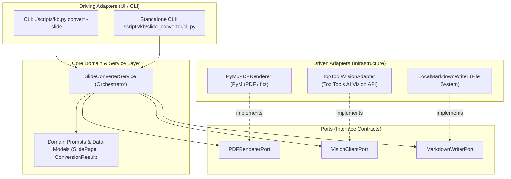

# 📊 Slide-to-Markdown Vision Converter

Modul konversi berkas presentasi PDF (ekspor dari PPT / Google Slides / Keynote) ke teks Markdown terstruktur dengan mempertahankan **hierarki layout**, **diagram alur (Mermaid.js)**, **tabel grafik**, dan **interpretasi elemen visual**.

---

## 🏛️ Arsitektur Sistem (Hexagonal Architecture / Ports & Adapters)

Modul ini mengadopsi prinsip **Clean Architecture**, **Interface-First Pattern**, dan **Single Responsibility Principle (SRP)**:



### Penjelasan Komponen & Pola Desain
1. **Interface-First Pattern (`ports.py`)**:
   - `PDFRendererPort`: Kontrak untuk membaca jumlah halaman dan merender halaman PDF ke base64 image.
   - `VisionClientPort`: Kontrak komunikasi dengan model AI Vision.
   - `MarkdownWriterPort`: Kontrak persistensi berkas Markdown.
2. **Single Responsibility Principle (SRP)**:
   - `renderer_pymupdf.py`: Hanya bertanggung jawab atas I/O PDF dan rendering citra.
   - `vision_toptools.py`: Hanya bertanggung jawab atas komunikasi HTTP payload OpenAI-compatible dengan Top Tools AI.
   - `writer_local.py`: Hanya bertanggung jawab memformat pembatas slide (`---`) dan menyimpan berkas.
   - `service.py`: Murni sebagai use-case orchestrator yang menerima port melalui *Explicit Dependency Injection*.
3. **Factory Method (`__init__.py`)**:
   - `create_slide_converter(config)` merakit adapter dan menyuntikkan dependensi secara otomatis.

---

## 🌟 Fitur Pemahaman Visual & Gambar

Saat membaca slide, model vision (`Top-Tools-Ai` atau `Qwen-3.8-Max`) menerapkan aturan ekstraksi:
* **Diagram Alur / Arsitektur**: Diterjemahkan menjadi blok kode ```mermaid ... ``` interaktif.
* **Grafik & Chart**: Data numerik diekstrak menjadi **Markdown Pipe Table** dilengkapi 1 kalimat analisis tren.
* **Foto / Screenshot UI**: Dirangkum ke dalam *contextual callout* semantik (`> 🖼️ **Visual**: ...`).
* **Hierarki**: Menggunakan heading `## Slide X: [Judul]` dan nested list.

---

## 🚀 Panduan Penggunaan

### 1. Menggunakan Utilitas Utama `kb.py`
```bash
# Konversi slide PDF menggunakan AI Vision (Top Tools AI)
./scripts/kb.py convert "kegiatan/sakernas/2026-08/materi_briefing.pdf" --slide

# Opsi model kustom (misal: Qwen-3.8-Max)
./scripts/kb.py convert "materi.pdf" --slide --model "Qwen-3.8-Max"
```

### 2. Menggunakan Standalone CLI
```bash
python scripts/kb/slide_converter/cli.py "materi.pdf" "materi.md"
```

### 3. Penggunaan Sebagai Python Module
```python
from pathlib import Path
from kb.slide_converter import create_slide_converter
from kb.utils import load_env

config = load_env()
converter = create_slide_converter(config)

result = converter.convert(
    pdf_path=Path("presentasi.pdf"),
    output_path=Path("presentasi.md")
)

print(f"Selesai mengonversi {result.total_slides} slide!")
```

---

## ⚙️ Konfigurasi `.env`

Pastikan variabel berikut ada di berkas `.env` pada root repositori:

```env
# Top Tools AI Vision Configuration
TOP_TOOLS_AI_API_KEY=sk-xxxxxxxxxxxxxxxxxxxxxxxxxxxx
TOP_TOOLS_AI_BASE_URL=https://top-tools-ai.com/api/v1
TOP_TOOLS_AI_MODEL=Top-Tools-Ai
```
