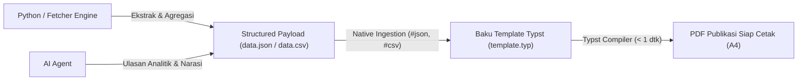

# Buku Panduan Standar Typst (Typst Handbook & Best Practices)
## BPS Kabupaten Mempawah Knowledge Base — Agentic AI & Human Guide

Dokumen ini merupakan **Single Source of Truth (SSOT)** dan panduan baku perancangan dokumen, laporan formal, dan buku publikasi cetak menggunakan **Typst** di lingkungan basis pengetahuan BPS Kabupaten Mempawah.

---

## 🏛️ 1. Kebijakan Utama: Typst-First Policy

Mulai September 2026, repositori ini memberlakukan **Typst-First Policy**:
1. **Mandat Absolut**: Setiap pembuatan buku publikasi (Desa Dalam Angka, Kecamatan Dalam Angka, Profil Statistik), Standar Operasional Prosedur (SOP), dokumen naskah dinas formal, dan laporan teknis siap cetak (A4/B5) **WAJIB menggunakan Typst (`.typ`)** sebagai engine rendering utama.
2. **Larangan HTML-to-PDF / Puppeteer untuk Buku**: Dilarang menggunakan kombinasi HTML+CSS murni yang dikonversi melalui Puppeteer/Chromium/Paged.js untuk buku atau laporan multi-halaman. Metode ini terbukti memboroskan memori (sering OOM pada dokumen ratusan halaman), tidak memiliki dot leader presisi, dan penanganan page-break yang rapuh.
3. **Pengecualian yang Diizinkan**: Format selain Typst hanya diizinkan untuk:
   - Dashboard web interaktif atau portal HTML dinamis (khusus untuk konsumsi peramban web langsung).
   - Permintaan eksplisit dokumen Word (`.docx`) untuk keperluan revisi pimpinan/rekan kantor.
   - Kasus ekstrem di mana fitur tertentu terbukti secara teknis belum didukung oleh Typst dan solusinya telah dicatat pada bagian *Known Gotchas & Workarounds* di dokumen ini.

---

## 🏗️ 2. Arsitektur Decoupled: Template-First + Structured Data Ingestion

Dalam pengembangan berbasis agen cerdas (Agentic AI), hindari menyuruh LLM menulis kode layout Typst ratusan baris dari nol (*raw code generation*). Terapkan pola **Decoupled Architecture**:



### Keuntungan Arsitektur Ini:
1. **Zero Layout Hallucination**: AI Agent hanya memikirkan validitas data dan narasi analisis statistik, tidak menyentuh ukuran font, padding, atau margin.
2. **Kecepatan Tinggi**: Kompilasi dokumen 400 halaman selesai dalam < 2 detik menggunakan engine Rust Typst.
3. **Pemisahan Peran**: Jika format sampul atau margin buku berubah, cukup edit satu berkas `template.typ` tanpa mengubah logika kalkulasi data di Python.

---

## 📐 3. Konfigurasi Standar Buku Publikasi BPS (A4 Recto-Verso)

### A. Pengaturan Halaman & Margin Cermin (Mirror / Recto-Verso)
Buku resmi yang dicetak bolak-balik membutuhkan margin dalam (punggung buku/jilid) yang lebih lebar daripada margin luar:

```typst
#set page(
  paper: "a4",
  margin: (
    inside: 2.5cm,  // Sisi jilid buku (kiri di hal ganjil, kanan di hal genap)
    outside: 1.5cm, // Sisi luar
    top: 2.0cm,
    bottom: 2.0cm,
  ),
  header: context {
    let page_num = counter(page).get().first()
    // Running header hanya muncul pada halaman Arab (Isi Utama), mati di Frontmatter Romawi
    if page_num > 9 {
      if calc.even(page_num) {
        align(left, text(8pt, fill: rgb("#6b7280"))[KABUPATEN MEMPAWAH DALAM ANGKA 2026])
      } else {
        align(right, text(8pt, fill: rgb("#6b7280"))[BAB 3: KETENAGAKERJAAN])
      }
    }
  },
  footer: context {
    let page_num = counter(page).get().first()
    if page_num <= 9 {
      // Halaman Romawi di Frontmatter (tengah bawah)
      align(center, text(9pt)[#counter(page).display("i")])
    } else {
      // Halaman Angka Arab di Isi Utama (pojok luar)
      if calc.even(page_num) {
        align(left, text(9pt)[#counter(page).display("1")])
      } else {
        align(right, text(9pt)[#counter(page).display("1")])
      }
    }
  }
)

#set text(
  font: ("Liberation Sans", "DejaVu Sans", "Arial"),
  size: 10pt,
  lang: "id"
)
#set par(justify: true, leading: 0.65em)
```

---

## 📊 4. Standar Tabel Statistik Kompleks & Multi-Halaman

Tabel dalam publikasi BPS seringkali terdiri dari puluhan hingga ratusan baris yang membelah beberapa halaman. Typst menangani ini secara *native*.

### Aturan Baku Tabel BPS:
1. **Judul Tabel Selalu di Atas**:
   ```typst
   #show figure.where(kind: table): set figure.caption(position: top)
   ```
2. **Izinkan Tabel Terbelah Halaman (Breakable)**:
   ```typst
   #show figure: set block(breakable: true)
   ```
3. **Ulangi Baris Kepala (Header) di Tiap Halaman**:
   Wajib menggunakan `table.header(repeat: true, ...)` agar saat tabel berpindah ke halaman baru, pembaca tetap memahami arti kolom:
   ```typst
   #figure(
     caption: [Jumlah Penduduk dan Rasio Jenis Kelamin menurut Kecamatan, 2026],
     table(
       columns: (0.8fr, 3fr, 1.5fr, 1.5fr, 1.5fr),
       align: (col, row) => if row == 0 { center + horizon } else if col <= 1 { left + horizon } else { right + horizon },
       stroke: (x, y) => if y == 0 { (top: 1pt + black, bottom: 0.5pt + black) } else if y == 1 { (bottom: 1pt + black) } else { none },
       table.header(
         repeat: true,
         [*No*], [*Kecamatan*], [*Laki-laki*], [*Perempuan*], [*Sex Ratio*]
       ),
       [1], [Siantan], [18.245], [17.890], [101,98],
       [2], [Segedong], [12.430], [12.110], [102,64],
       [3], [Sungai Pinyuh], [31.500], [30.980], [101,68],
       // Baris total dengan garis bawah penutup
       table.cell(colspan: 2, stroke: (top: 0.5pt + black, bottom: 1pt + black))[*Total Kabupaten*],
       table.cell(stroke: (top: 0.5pt + black, bottom: 1pt + black))[*62.175*],
       table.cell(stroke: (top: 0.5pt + black, bottom: 1pt + black))[*60.980*],
       table.cell(stroke: (top: 0.5pt + black, bottom: 1pt + black))[*101,96*]
     )
   )
   ```
4. **Prinsip Garis Bersih (*Booktabs Style*)**:
   - Hindari garis vertikal kisi-kisi (`vertical strokes: none`).
   - Gunakan hanya 3 garis horizontal utama: garis atas tabel, garis pemisah header, dan garis penutup di baris total/paling bawah.

---

## 📑 5. Daftar Isi & Daftar Tabel Berulang (Dot Leaders)

Jangan pernah membuat titik-titik daftar isi secara manual. Typst menghitung jarak titik-titik (*dot leaders*) secara presisi tingkat milimeter menggunakan fungsi `repeat([. ])`:

```typst
// Daftar Isi
#outline(
  title: [DAFTAR ISI],
  indent: auto,
  fill: repeat([. ])
)

#pagebreak()

// Daftar Tabel Otomatis
#outline(
  title: [DAFTAR TABEL],
  target: figure.where(kind: table),
  fill: repeat([. ])
)

#pagebreak()

// Daftar Gambar & Grafik Otomatis
#outline(
  title: [DAFTAR GAMBAR],
  target: figure.where(kind: image),
  fill: repeat([. ])
)
```

---

## 🧮 6. Sintaks Matematika & Variabel Teknis

1. **Rumus Indikator / Fraksi**:
   Typst menggunakan sintaks fraksi matematika native:
   ```typst
   $ "Sex Ratio" = frac(sum "Penduduk Laki-laki", sum "Penduduk Perempuan") times 100 $
   ```
2. **Wrapping Nama Variabel Panjang (Underscore Trap)**:
   Variabel database seperti `prelist_updating_sakernas_se2026_intersect` sering meluber keluar tabel. Buat helper fungsi dengan zero-width space `\u{200b}`:
   ```typst
   #let wrap-var(name) = {
     let clean = name.replace("_", "_\u{200b}")
     raw(clean)
   }
   ```

---

## 🔄 7. Compiler Diagnostics & Self-Healing Loop (Untuk Agentic AI)

Jika AI Agent mengeksekusi kompilasi Typst melalui Python, gunakan pola loop diagnosa berikut:

```python
import subprocess

def compile_typst(typst_path: str, pdf_path: str):
    cmd = ["typst", "compile", typst_path, pdf_path]
    result = subprocess.run(cmd, capture_output=True, text=True)
    
    if result.returncode != 0:
        # Compiler Typst memberikan pesan error presisi (baris, kolom, saran)
        error_msg = result.stderr
        print(f"❌ Kompilasi Typst Gagal:\n{error_msg}")
        # AI Agent membaca error_msg, membuka baris terkait, memperbaikinya, dan kompilasi ulang
        raise RuntimeError(f"Typst Compilation Error: {error_msg}")
        
    print(f"✓ Berhasil mengompilasi: {pdf_path}")
```

---

## 📝 8. Living Gotchas & Workarounds Register (Catatan Masalah & Solusi)

*Bagian ini wajib diperbarui setiap kali ditemukan kasus tepi (edge cases) atau bug baru yang terselesaikan.*

| No | Masalah / Gejala | Penyebab | Solusi Permanen / Workaround |
| :-: | :--- | :--- | :--- |
| 1 | **Tabel tidak mau terpotong halaman (overflow)** | `figure` secara default membungkus konten dalam blok `breakable: false`. | Tambahkan `#show figure: set block(breakable: true)` di awal dokumen. |
| 2 | **Header romawi tetap muncul di frontmatter** | Parameter `header` global dievaluasi di setiap halaman tanpa mengecek nomor halaman. | Gunakan blok `context { let page = counter(page).get().first(); if page > 9 { ... } }` untuk mematikan header di halaman awal. |
| 3 | **Font tidak ditemukan di sistem Linux** | Typst mencari font di direktori font sistem. | Gunakan urutan fallback aman: `font: ("Liberation Sans", "DejaVu Sans", "Arial")`. |
| 4 | **Underscore memicu italic atau overflow** | Underscore di luar mode math atau string panjang tanpa spasi tidak dapat di-wrap browser/engine. | Bungkus dengan `raw(...)` atau gunakan zero-width space `_\u{200b}`. |
| 5 | **ISSN / Katalog BPS Palsu** | Kebiasaan menyalin format publikasi pusat ke publikasi tingkat desa. | **Aturan Ketat**: DDA / Publikasi Desa tidak memiliki ISSN, No Katalog, atau No Publikasi. Halaman ii hanya memuat kotak hak cipta dan tim penyusun. |
| 6 | **Header & Footer tercetak di Halaman Kosong (*Blank Page*) hasil `pagebreak(to: "odd")`** | Typst secara default mewarisi header dan footer dari `page(...)` pada halaman kosong transisi. | Gunakan query elemen locatable di blok context `header` dan `footer`: `let p = here().page(); let elements = query(selector.or(heading, figure, metadata)); let has_content = elements.any(m => m.location().page() == p); if not has_content { return none }`. Pasang `#metadata("...")` di halaman-halaman awal yang perlu dideteksi. |
