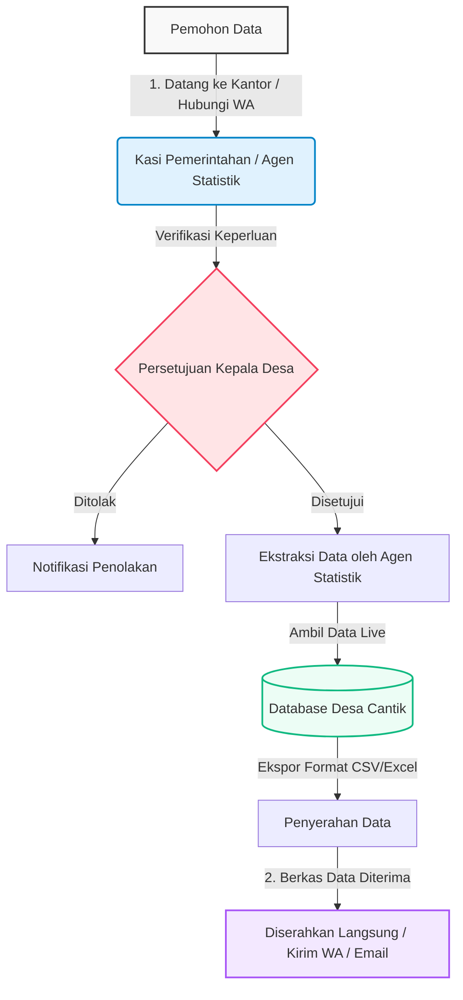
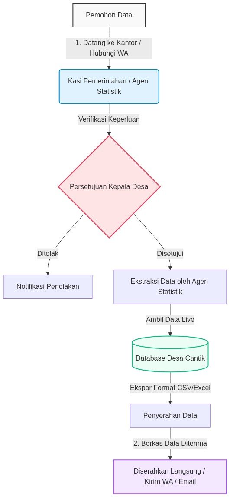

# STANDAR OPERASIONAL PROSEDUR (SOP) PERMINTAAN DATA
## Hasil Kegiatan Desa Cantik (Desa Cinta Statistik)
**Desa Sungai Bakau Kecil, Kabupaten Mempawah**

---

### 1. Latar Belakang
Dalam rangka mendukung keterbukaan informasi publik dan pemanfaatan data hasil pembinaan Desa Cantik (Desa Cinta Statistik) Sungai Bakau Kecil Tahun 2026, disusun Standar Operasional Prosedur (SOP) permintaan data. Data yang dikumpulkan melalui instrumen Rukun Tetangga (RT) dan Fasilitas Desa disimpan secara terpusat untuk keperluan pembangunan desa.

### 2. Sumber Data (Database Pool)
Data yang dapat diminta bersumber langsung dari basis data yang ter-update secara real-time melalui aplikasi AppSheet, yang terhubung dengan basis data terpusat:
*   **Nama Database**: Database Desa Cantik Sungai Bakau Kecil
*   **Tabel RT (`Daftar_RT`)**: Karakteristik penduduk laki-laki/perempuan, kepala keluarga (KK), lansia, balita, sarana pendidikan, dan penerima bantuan sosial (PKH, BPNT, BST, BLT).
*   **Tabel Fasilitas (`Fasilitas`)**: Koordinat GPS, kategori fasilitas, utilitas listrik/air bersih, kondisi bangunan, dan telekomunikasi.

---

### 3. Diagram Alur Permintaan Data (Business Process Flowchart)

---

### 4. Prosedur Operasional (Rantai Proses Pendek)
Proses bisnis dirancang dengan rantai birokrasi pendek (maksimal 1 hari kerja):

| Tahap | Pelaku | Aktivitas | Durasi | Output |
| :---: | :--- | :--- | :---: | :--- |
| **1** | Pemohon | Datang langsung ke kantor desa atau menghubungi Kasi Pemerintahan (Agen Statistik) via WhatsApp (+62 815-4928-3541). | 10 Menit | Permohonan Diterima |
| **2** | Kasi Pemerintahan / Kades | Memverifikasi maksud permintaan data dan meminta persetujuan Kepala Desa untuk rilis data. | Max 2 Jam | Persetujuan Rilis |
| **3** | Agen Statistik | Mengekstraksi data secara langsung (live-query) dari Database Desa Cantik (tabel `Daftar_RT` dan `Fasilitas`). | 15 Menit | Dokumen Ekspor Data |
| **4** | Agen Statistik | Menyerahkan berkas data secara langsung atau mengirimkan file via WhatsApp/Email pemohon. | 5 Menit | Data Diterima Pemohon |

---

### 5. Aturan Hak Akses & Keamanan Data
1. Data individu/mikro (nama penduduk spesifik) bersifat rahasia dan **tidak dipublikasikan** untuk melindungi privasi sesuai UU No. 27/2022 tentang Pelindungan Data Pribadi (PDP).
2. Data yang diserahkan berupa data agregat tingkat RT atau data fasilitas umum desa.
3. Pemohon dilarang menggunakan data Desa Cantik untuk keperluan komersial tanpa izin tertulis dari Pemerintah Desa.

---

### 6. Pengesahan & Tanda Tangan

Mempawah, 6 Agustus 2026

**Mengesahkan,** **Kepala Desa Sungai Bakau Kecil**

**( ___________________________ )**
