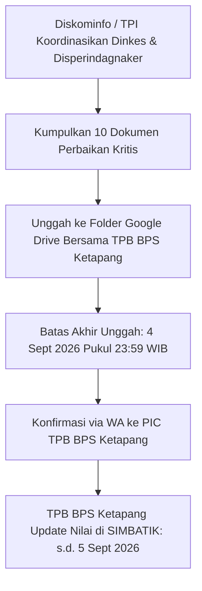

# Analisis Hasil Pleno Provinsi EPSS 2026 & Rencana Aksi Perbaikan Dokumen Pemkab Mempawah

**Tanggal Pleno:** 3–4 September 2026  
**Penyelenggara:** BPS Provinsi Kalimantan Barat  
**Pihak Penilai (TPB):** BPS Kabupaten Ketapang  
**Pihak Dinilai (TPI):** Pemerintah Kabupaten Mempawah (Diskominfo, Dinkes, Disperindagnaker)  
**Tenggat Waktu Perbaikan:** **Jumat, 4 September 2026 Pukul 23:59 WIB**  
**Tenggat Waktu Penyesuaian SIMBATIK oleh TPB:** **Sabtu, 5 September 2026**  
**Tautan Bahan Tayang (Google Slides):** [Bahan Tayang Pleno Provinsi 2026](https://docs.google.com/presentation/d/1NLduIivFp5yeCW8gqYuLfHMblq-VJXSL/edit?slide=id.p1#slide=id.p1)  
**Berkas PDF Lokal:** [bahan-tayang-pleno-mempawah.pdf](bahan-tayang-pleno-mempawah.pdf)

---

## 📌 1. Latar Belakang & Urgensi

Pada pelaksanaan Rapat Pleno Provinsi Kalimantan Barat tanggal 3–4 September 2026, dilakukan evaluasi silang hasil penilaian pra-harmonisasi seluruh 14 Kabupaten/Kota di Kalbar. Hasil pleno menunjukkan bahwa **Pemerintah Kabupaten Mempawah mengalami penurunan signifikan pada 10 Indikator yang diberi Nilai 1 (dari skala 5)** oleh BPS Kabupaten Ketapang selaku Tim Penilai Badan (TPB). 

Sesuai aturan pleno provinsi:
1. Setiap indikator yang diberi nilai kematangan $\ge 3$ oleh TPB **wajib memiliki dokumen kebijakan/regulasi formal yang valid dan relevan**.
2. TPI Pemkab Mempawah diberikan batas waktu perbaikan hingga **Jumat, 4 September 2026 pukul 23:59 WIB** untuk menyerahkan bukti dukung perbaikan melalui folder Google Drive bersama TPB BPS Ketapang.
3. TPB BPS Ketapang melakukan penyesuaian nilai di aplikasi **SIMBATIK** sampai dengan **5 September 2026**.

---

## 📊 2. Rekapitulasi 10 Indikator Kritis Nilai 1

Dua kegiatan statistik sektoral yang dinilaikan oleh Pemkab Mempawah pada EPSS 2026 adalah:
1. **Dinas Kesehatan (Dinkes-PPKB):** Kompilasi Data Profil Kesehatan Kabupaten Mempawah.
2. **Dinas Perdagangan, Perindustrian, dan Tenaga Kerja (Disperindagnaker):** Kompilasi Data Pedagang Pasar Rakyat Kabupaten Mempawah (serta Kompilasi Produk Administrasi Data Pencari Kerja).

Berikut adalah daftar 10 indikator yang mendapat nilai 1 beserta perbandingannya terhadap tahun 2024:

| No | Kode | Nama Indikator | Domain | Skor 2024 | Skor 2026 | Perubahan | OPD Terkait |
| :---: | :---: | :--- | :---: | :---: | :---: | :---: | :--- |
| 1 | **20201** | Penilaian Akurasi Data | Domain 2 | 3 | **1** | 🔴 Turun 2 | Dinkes & Disperindag |
| 2 | **20301** | Penjaminan Aktualitas Data | Domain 2 | 3 | **1** | 🔴 Turun 2 | Dinkes & Disperindag |
| 3 | **20302** | Pemantauan Ketepatan Waktu Diseminasi | Domain 2 | 3 | **1** | 🔴 Turun 2 | Dinkes, Disperindag, Kominfo |
| 4 | **20501** | Keterbandingan Data | Domain 2 | 3 | **1** | 🔴 Turun 2 | Dinkes & Disperindag |
| 5 | **20502** | Konsistensi Statistik | Domain 2 | - | **1** | 🔴 Terendah | Dinkes & Disperindag |
| 6 | **30302** | Analisis Data | Domain 3 | 3 | **1** | 🔴 Turun 2 | Dinkes & Disperindag |
| 7 | **40102** | Netralitas & Objektifitas Metodologi | Domain 4 | 2 | **1** | 🔴 Turun 1 | Dinkes & Disperindag |
| 8 | **40103** | Penjaminan Kualitas Data | Domain 4 | 2 | **1** | 🔴 Turun 1 | Diskominfo (Walidata) |
| 9 | **50103** | Sosialisasi & Literasi Data Statistik | Domain 5 | 2 | **1** | 🔴 Turun 1 | Diskominfo & BPS |
| 10 | **50301** | Perencanaan Pembangunan Statistik | Domain 5 | - | **1** | 🔴 Terendah | Diskominfo & Bapperida |
| *11* | *40302* | Penyelenggaraan Forum SDI | Domain 4 | 3 | **2** | 🟡 Turun 1 | Diskominfo & Bapperida |

---

## 🛠️ 3. Rencana Aksi & Kebutuhan Dokumen Bukti Dukung (Action Plan)

### A. Domain 2: Kualitas Data (Fokus Utama Intervensi)

#### 1. Indikator 20201: Penilaian Akurasi Data (Target Naik ke Level 2 / 3)
* **Akar Masalah:** Dinilai tidak memiliki bukti proses pengecekan kualitas data, kelengkapan isian, atau penanganan duplikasi data.
* **Tindakan Diskominfo / OPD:**
  - **Dinkes:** Siapkan Berita Acara / Laporan Verifikasi Data Profil Kesehatan (dokumentasi pengecekan kelengkapan puskesmas, eliminasi data dobel pasien/fasilitas, dan validasi angka stunting/kematian ibu).
  - **Disperindag:** Laporan pembersihan data pasar (deteksi nama pedagang ganda, verifikasi izin aktif/tutup).
  - Sertakan tangkapan layar proses validasi rumus/cleaning data pada Excel/aplikasi.

#### 2. Indikator 20301: Penjaminan Aktualitas Data (Target Naik ke Level 2 / 3)
* **Akar Masalah:** Jeda waktu (*time lag*) antara periode data dan rilis dinilai tanpa dasar kesepakatan tertulis.
* **Tindakan Diskominfo / OPD:**
  - Unggah dokumen **Kerangka Acuan Kerja (KAK)** atau **Surat Kesepakatan / SK Pengumpulan Data** yang memuat klausul batas waktu rilis data (misal: data Profil Kesehatan tahun $T-1$ disepakati wajib selesai dihimpun dan diterbitkan maksimal bulan Juni tahun $T$).
  - Perlihatkan perbandingan antara *reference period* dengan tanggal rilis aktual yang membuktikan data dirilis tepat waktu saat dibutuhkan untuk perencanaan daerah.

#### 3. Indikator 20302: Pemantauan Ketepatan Waktu Diseminasi (Target Naik ke Level 2 / 3)
* **Akar Masalah:** Tidak ada bukti pengumuman jadwal rilis ke publik (*Advance Release Calendar* / ARC) dan bukti pemantauan realisasinya.
* **Tindakan Diskominfo / OPD:**
  - Unggah **Jadwal Rilis Publikasi (Kalender Rilis)** yang dipublikasikan di website portal Satu Data Mempawah / website Dinkes.
  - Lampirkan **Laporan Pemantauan Ketepatan Waktu Diseminasi**: lembar checklist perbandingan tanggal rencana publikasi vs tanggal rilis faktual.

#### 4. Indikator 20501: Keterbandingan Data (Target Naik ke Level 2 / 3)
* **Akar Masalah:** Data statistik sektoral dinilai tidak menyajikan keterbandingan antarwaktu atau antardaerah.
* **Tindakan Diskominfo / OPD:**
  - Tunjukkan bab/tabel di buku Profil Kesehatan atau Laporan Pasar yang memuat **deret waktu (series 3–5 tahun)** atau **perbandingan capaian antarkecamatan di Kabupaten Mempawah**.
  - Catatan penjelasan (*footnote/metadata*) yang menegaskan kepatuhan terhadap klasifikasi standar baku (misal pengkodean ICD-10 Kemenkes untuk jenis penyakit).

#### 5. Indikator 20502: Konsistensi Statistik (Target Naik ke Level 2 / 3)
* **Akar Masalah:** Tidak ada dokumen bukti rekonsiliasi data jika ada perbedaan angka dengan instansi lain.
* **Tindakan Diskominfo / OPD:**
  - Unggah **Berita Acara Rekonsiliasi Data**: Bukti rapat rekonsiliasi/sinkronisasi angka SPM Kesehatan antara Dinkes dengan Puskesmas/RSUD/BPS, atau data ketenagakerjaan dengan Disnakertrans Provinsi/BPJS Ketenagakerjaan.
  - Tunjukkan lembar catatan penjelasan metodologis pada publikasi jika terjadi perbedaan konsep data.

---

### B. Domain 3: Proses Bisnis Statistik

#### 6. Indikator 30302: Analisis Data (Target Naik ke Level 2 / 3)
* **Akar Masalah:** Publikasi dianggap sekadar kompilasi tabel angka tanpa ulasan narasi/analisis tren, serta ketiadaan *statistical disclosure control*.
* **Tindakan Diskominfo / OPD:**
  - Tunjukkan bagian **Bab Analisis Deskriptif / Ulasan Narasi** dalam dokumen Profil Kesehatan (grafik tren capaian, analisis penyebab peningkatan/penurunan, narasi kebijakan).
  - Tunjukkan bahwa data disajikan dalam format agregat untuk menjamin kerahasiaan identitas perorangan (*disclosure control*).

---

### C. Domain 4: Kelembagaan

#### 7. Indikator 40102: Netralitas & Objektifitas Metodologi (Target Naik ke Level 2 / 3)
* **Akar Masalah:** Ketiadaan bukti formal komitmen netralitas dan transparansi metodologi.
* **Tindakan Diskominfo / OPD:**
  - Buat dan unggah **Pakta Integritas / Surat Pernyataan Komitmen Netralitas Metodologi** yang ditandatangani Kepala OPD / Tim Teknis Data bahwa pengumpulan data menggunakan metode ilmiah yang objektif dan bebas intervensi.
  - Lampirkan KAK yang memuat penjelasan metodologis pengumpulan data administratif.

#### 8. Indikator 40103: Penjaminan Kualitas Data (Target Naik ke Level 2 / 3)
* **Akar Masalah:** Walidata (Diskominfo) dinilai belum memiliki regulasi/SOP pemeriksaan mutu data (*quality assurance*).
* **Tindakan Diskominfo:**
  - Unggah **SOP / Petunjuk Teknis Verifikasi dan Validasi Data Sektoral oleh Walidata**.
  - Lampirkan **SK Tim Pembina / Tim Walidata / Tim Pemeriksa Data Daerah** (yang memuat uraian tugas pemeriksaan kualitas data).
  - Formulir/Lembar Hasil Pemeriksaan Mutu (*Quality Checklist*) yang telah diverifikasi oleh staf fungsional statistisi Diskominfo.

#### 9. Indikator 40302: Penyelenggaraan Forum SDI (Target Naik dari Level 2 ke Level 3)
* **Tindakan Diskominfo:**
  - Unggah berkas lengkap **Rapat Forum SDI Tahun 2026**: Undangan, Daftar Hadir seluruh OPD, Notula, Foto Dokumentasi, dan **Berita Acara Kesepakatan Daftar Data Prioritas Daerah Tahun 2026**.

---

### D. Domain 5: Statistik Nasional

#### 10. Indikator 50103: Sosialisasi & Literasi Data Statistik (Target Naik ke Level 2 / 3)
* **Akar Masalah:** Kegiatan edukasi atau penyebarluasan pemahaman statistik sektoral dinilai minim dokumentasi.
* **Tindakan Diskominfo & BPS:**
  - Unggah bukti **Dokumentasi Bimbingan Teknis / Sosialisasi Metadata & Statistik Sektoral** untuk OPD / Kecamatan.
  - Lampirkan Surat Undangan, Notula, Daftar Hadir, Foto Kegiatan, dan Materi Presentasi.
  - Lampirkan tangkapan layar siaran pers (*press release*) atau infografis statistik yang diunggah di media sosial / portal resmi Pemkab Mempawah.

#### 11. Indikator 50301: Perencanaan Pembangunan Statistik (Target Naik ke Level 2 / 3)
* **Akar Masalah:** Belum memiliki dokumen perencanaan jangka menengah/panjang statistik sektoral (Rencana Aksi SDI).
* **Tindakan Diskominfo & Bapperida:**
  - Unggah **Dokumen Rencana Aksi Satu Data Indonesia (SDI) Kabupaten Mempawah** (atau Keputusan Bupati / draft yang telah disepakati Forum SDI).
  - Jika belum ada SK khusus, lampirkan Bab Pengembangan Statistik Sektoral dalam **Renstra Diskominfo / Renja Pemkab Mempawah**.

---

## 🏆 4. Capaian Prestasi & Nilai Tertinggi Mempawah (Tetap Dipertahankan)

Meskipun terdapat penurunan pada indikator di atas, beberapa indikator Mempawah diakui sangat unggul di tingkat Provinsi Kalimantan Barat:
1. **Indikator 10101 (Standar Data Statistik): NILAI 4** — *Tertinggi di seluruh Kalimantan Barat!*
2. **Indikator 50303 (Pemanfaatan Big Data): NILAI 3** — *Satu-satunya Kabupaten di Kalbar yang mencapai Nilai 3!*
3. **Indikator 30301 (Pengolahan Data): NILAI 3** — Naik signifikan 2 poin dari Nilai 1 (2024) menjadi Nilai 3 (2026).
4. **Indikator 20402, 30102, 30201, 30401, 40101, 40104:** Berada di peringkat atas dengan **Nilai 3 (Baik)**.

---

## ⚡ 5. Alur Komunikasi & Pengiriman Berkas Perbaikan

