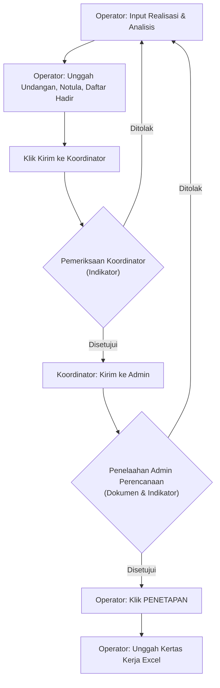

# Evaluasi SAKIP dan Sinergi (2026)

## Deskripsi Kegiatan
Evaluasi SAKIP (Sistem Akuntabilitas Kinerja Instansi Pemerintah) dan pelaporan capaian kinerja di lingkungan Badan Pusat Statistik menggunakan aplikasi **SINERGI**. Pelaksanaan pengukuran kinerja dilakukan secara berkala (triwulanan dan tahunan) dengan membandingkan realisasi kinerja terhadap target yang tercantum dalam dokumen Perjanjian Kinerja (PK) pada tahun berjalan serta target jangka menengah Rencana Strategis (Renstra) 5 tahunan.

---

## 📅 Timeline & Batas Waktu Pelaporan Triwulan II 2026

Proses pelaporan Triwulan II tahun 2026 mengikuti jadwal penting berikut:

| Tahapan Kegiatan | Batas Akhir | Pelaksana | Keterangan |
| :--- | :---: | :--- | :--- |
| **Rapat & Input Sinergi** | **22 Juli 2026** | Operator Perencanaan | Rapat monitoring selesai dilaksanakan dan data realisasi/analisis di-entry di Sinergi. |
| **Batas Perbaikan Entry** | **31 Juli 2026** | Operator Perencanaan | Melakukan perbaikan jika ada berkas yang ditolak oleh Admin Perencanaan. |
| **Batas Akhir Penelaahan** | **04 Agustus 2026** | Admin Perencanaan | Pemeriksaan final oleh Biro Perencanaan (Pusat/Provinsi) atau Admin Provinsi (Kabupaten/Kota). |
| **Penetapan Data** | **04 Agustus 2026** | Operator Perencanaan | Melakukan tombol penetapan di Sinergi setelah disetujui (Wajib agar terbaca sistem). |
| **Unggah ESR (BPS Provinsi)** | **10 Agustus 2026** | Tim SAKIP Provinsi | Mengunggah kertas kerja pengukuran kinerja TW II BPS Provinsi ke ESR (Laporan Monev). |

---

## 🔄 Perubahan Penting Proses Bisnis di Triwulan II 2026

Dibandingkan dengan Triwulan I, terdapat beberapa perubahan signifikan pada proses pelaporan Triwulan II 2026:

1.  **Metode Input di Sinergi (Beralih ke Direct Entry)**:
    *   *Sebelumnya (TW I)*: Satker hanya mengunggah file kertas kerja Excel ke Sinergi, kemudian sistem menarik data secara semi-otomatis.
    *   *Sekarang (TW II)*: Operator wajib melakukan **input data secara manual (direct entry)** untuk realisasi dan analisis kinerja per indikator di menu Sinergi (mirip proses input Perjanjian Kinerja). Unggah kertas kerja tetap wajib dilakukan di akhir sebagai dokumen pembanding.
2.  **Data Triwulan I Dikunci**:
    *   Data TW I statusnya sudah ditetapkan dan **terkunci penuh** (tidak dapat diutak-atik lagi) karena sedang dievaluasi oleh Inspektorat. Satker langsung fokus pada entry data TW II.

---

## 📊 Ketentuan Teknis Kertas Kerja Pengukuran Kinerja (Excel)

Kertas kerja Excel berfungsi sebagai instrumen bantu perhitungan (Kertas Kerja) sebelum di-entry ke aplikasi Sinergi. Aturan pengisian meliputi:

*   **Batas Capaian Maksimum**: Nilai capaian kinerja maksimum per indikator dibatasi sebesar **120**.
*   **Target Kosong, Realisasi Ada**: Jika target tidak dianggarkan di triwulan berjalan namun realisasi berhasil dirilis, nilai capaian otomatis terhitung **120**.
*   **Belum Ada Realisasi**: Untuk indikator yang belum dinilai (misalnya indeks kualitas laporan/publikasi statistik sektoral), capaian diisi dengan tanda hubung/strip (`-`), bukan angka `0` (nol), agar tidak dianggap tidak berkinerja.
*   **Perubahan Kode Indikator**:
    *   Nilai SAKIP: diubah dari `3324` menjadi **`3241`**.
    *   Indeks Implementasi Berakhlak: diubah dari `3325` menjadi **`3242`**.
    *   *Catatan*: Kode ini harus sesuai agar data tersinkronisasi dengan database Sinergi.
*   **Ketentuan 11 Satker Baru**: Khusus untuk 11 satker baru (karena belum dinilai SAKIP oleh Inspektorat), indikator Nilai SAKIP **dikecualikan/tidak diperhitungkan** dalam agregasi capaian kinerja total di baris paling bawah.
*   **Larangan Modifikasi**: Dilarang menambah/menghapus baris pendukung kuesioner (seperti baris X dan Y pada indikator publikasi) agar format pembacaan database tidak rusak.
*   **Angka Desimal**: Untuk indikator numerik, pembulatan di-entry hingga **5 angka di belakang koma** (contoh: target 3, realisasi 1 ditulis `1.33333` di Sinergi).

---

## 📝 Aturan Kelengkapan Dokumen & Notulen Rapat

Setiap rapat monitoring kinerja triwulanan wajib menyertakan bukti fisik akuntabilitas (undangan, notula, daftar hadir) dengan standar evaluasi sebagai berikut:

### 1. Kriteria Rapat
*   **Kehadiran Pimpinan**: Rapat wajib dipimpin langsung oleh pimpinan satker (Kepala BPS).
*   **Batas Minimal Kehadiran Staf**: Rapat monitoring kinerja di level BPS Provinsi dan Kabupaten/Kota (Eselon II) **minimal dihadiri oleh 80% pegawai**.

### 2. Kriteria Dokumen Notulen
*   Notulen harus ditandatangani oleh pimpinan.
*   Memuat informasi target, realisasi, capaian, analisis kendala, solusi, rencana tindak lanjut (RTL), PIC penanggung jawab, dan tenggat waktu per IKU.
*   Memuat realisasi anggaran dan upaya efisiensi.
*   **Realisasi Volume Rincian Output (RO)**: Melaporkan realisasi volume RO sesuai kondisi pada **tanggal pelaksanaan rapat** (jika ada perbedaan dengan Caput karena proses validasi dinamis, ikuti data per tanggal rapat dan tuliskan tanggal cutoff datanya di notulen).
*   **Keterlibatan Program Strategis**: Notulen wajib memuat laporan keterlibatan/dukungan satker terhadap program nasional, prioritas presiden, dan isu strategis:
    1.  *RO Prioritas Nasional*: Inflasi, pembinaan statistik sektoral (PN 07), big data, dll.
    2.  *Prioritas Presiden*: Mandat tertulis (Inpres/Keppres) seperti Pensasaran Percepatan Penghapusan Kemiskinan Ekstrem (P3KE), ketahanan pangan, DTS (Data Terpadu Kesejahteraan Sosial), dll.
    3.  *Isu Strategis*: Mandat subject matter BPS seperti Sensus Ekonomi 2026.
    *   *Catatan*: Jika satker tidak memiliki aktivitas riil pendukung di triwulan berjalan, tabel RO prioritas dapat dihapus, atau narasinya digabung menjadi penjelasan umum dukungan administratif di bawah kesekretariatan.

---

## 💻 Diagram Alur Penggunaan Aplikasi Sinergi

### Panduan Langkah Operator di Sinergi:
1.  Buka menu **Pengukuran** -> **Monitoring Capaian Kinerja** -> **Entry/Ubah**.
2.  Input nilai realisasi triwulan berjalan per indikator beserta analisis kendala, solusi, RTL, PIC, dan tautan bukti dukung. Klik **Simpan**.
3.  Unggah berkas pendukung (Notulen, Undangan, Daftar Hadir) dengan mencentang kriteria checklist yang sesuai di aplikasi.
4.  Klik **Kirim** (tombol kirim baru aktif setelah seluruh dokumen terunggah).
5.  Setelah status berubah menjadi **Disetujui Admin Perencanaan**, masuk ke menu **Penetapan** dan klik **Penetapan** (Wajib dilakukan agar data terekam secara permanen).
6.  Masuk ke menu **Upload Kertas Kerja** untuk mengunggah berkas Excel kertas kerja dan menyisipkan tautan (link) Google Drive dokumen rapat.

---

## 💬 Catatan Koordinasi Grup SAKIP (Triwulan II 2026)

### 1. Tautan & Akses Pelaporan
*   **Sheet Monitoring Internal**: [s.bps.go.id/puncak6104](https://s.bps.go.id/puncak6104) (digunakan untuk mengumpulkan isian per modul kegiatan sebelum di-entry oleh operator ke Sinergi).
*   **Tautan Rapat Internalisasi**: [s.bps.go.id/InternalisasiSINERGI](https://s.bps.go.id/InternalisasiSINERGI) / [Rekaman YouTube](https://www.youtube.com/live/RRDgi3RGREM).

### 2. Nilai Capaian Riil Indikator Kunci (TW II 2026)
Berdasarkan diskusi koordinasi tim SAKIP:
*   **Nilai Sektoral (Evaluasi Sektoral / EPSS)**: **64,92** (Dikonfirmasi oleh Ihza Karunia).
*   **Nilai PEKPPP (Indeks Pelayanan Publik / IPP)**: **1,17934** (Dikonfirmasi oleh Ihza Karunia).
*   **Nilai Self-Assessment SAKIP Mempawah**: **> 77,75** (Lebih tinggi dari BPS Kapuas Hulu yang bernilai 77,75).

### 3. Monitoring Isian Sheet Internal (Kondisi 18 Juli 2026 Pagi)
Terdapat 10 sub-kegiatan/bagian yang diingatkan oleh operator (Rifky) untuk segera melengkapi isian di sheet monitoring internal malam ini:
1.  Sumber Daya Mineral
2.  Sumber Daya Hayati
3.  Industri
4.  KTI
5.  Nerpro
6.  Nerpeng
7.  Analis Pengembangan Stat
8.  Sektoral *(Sudah diisi & dikonfirmasi oleh Ihza)*
9.  Akses data
10. Dukman
*   *Staf Terkait*: Syarifah Apriani, Listio, Sarah, Ihza Karunia.

### 4. Tindak Lanjut Rekomendasi LHE (Hasil Koordinasi Provinsi Kalbar)
*   **Kekeliruan Dokumen Bukti RTL Triwulan I 2026**:
    *   *Masalah*: Terdapat kekeliruan umum di mana Satker mengunggah tautan bukti dukung RTL TW IV 2025.
    *   *Aturan*: Dokumen bukti pelaksanaan kegiatan rencana tindak lanjut atas capaian TW I 2026 harus berupa kegiatan pelaksanaan rencana aksi/RTL yang dilakukan di triwulan berikutnya, yaitu **Triwulan II 2026 (April–Juni 2026)**.
    *   *Tautan Folder Google Drive Penyesuaian*: [Google Drive Folder Bukti RTL](https://drive.google.com/drive/folders/1WHbEXeyMdQm_XNAp5syh86VRTPkbP6Hs?usp=sharing).
*   **Jawaban Rekomendasi Renstra**:
    *   *Rekomendasi*: *"Meningkatkan kualitas perencanaan strategis dengan menyempurnakan notulen penetapan target Renstra melalui penambahan dasar hitung yang sistematis, basis data pendukung yang valid, dan alasan logis yang komprehensif untuk setiap target"*.
    *   *Keputusan*: Dijawab **"Tidak"**, dikarenakan belum ada instruksi penyusunan dan penetapan Renstra di setiap unit kerja/satker daerah.

