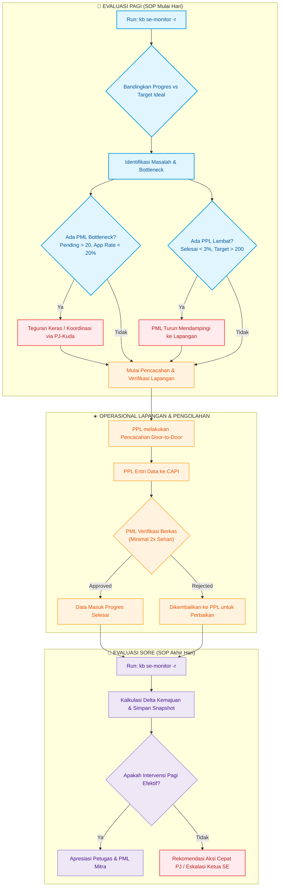

# Sensus Ekonomi 2026 (2026)

## Deskripsi Kegiatan
Sensus Ekonomi 2026 (SE2026) merupakan kegiatan 10-tahunan BPS yang bertujuan untuk menyajikan data dasar seluruh kegiatan ekonomi (kecuali sektor pertanian) di wilayah NKRI. Di tingkat Kabupaten Mempawah, pengorganisasian lapangan dipimpin oleh PJ-Kuda, yang membawahi beberapa PML (Pengawas/Pemeriksa), dan masing-masing PML membawahi beberapa PPL (Pencacah Lapangan).

## Monitoring Progres Lapangan
Guna memastikan kelancaran progres pendataan yang dilakukan oleh PPL serta ketepatan waktu verifikasi oleh PML, telah disediakan utilitas monitoring otomatis.

### Cara Menjalankan Monitoring
Untuk melakukan evaluasi kesehatan progres dan intervensi, jalankan perintah berikut di root repositori:

```bash
# ✅ PERINTAH BAKU (Pagi & Sore) — Laporan 6-Seksi Lengkap
./scripts/kb.py se-monitor -r

# --- Perintah tambahan (jika diperlukan detail lebih) ---
# Ringkasan progres tim Ihza Fikri Zaki Karunia
./scripts/kb.py se-monitor

# Peringkat seluruh PJ-Kuda Kabupaten Mempawah
./scripts/kb.py se-monitor --all-pj

# Daftar intervensi se-kabupaten (tabel mentah)
./scripts/kb.py se-monitor -i

# Ringkasan progres dan peringkat seluruh Kab/Kota di Kalbar
./scripts/kb.py se-monitor --prov
```

### Indikator Kesehatan Progres
Utilitas monitoring mengukur 3 indikator utama:
1.  **Worked Rate** (Rasio Mulai): `(DRAFT + SUBMITTED + APPROVED) / Target`. Mengukur keaktifan PPL di lapangan.
2.  **Completed Rate** (Rasio Selesai): `(SUBMITTED + APPROVED) / Target`. Rata-rata kabupaten saat ini menjadi acuan batas minimal kesehatan progres.
3.  **Approval Rate** (Rasio Pemeriksaan): `APPROVED / (APPROVED + SUBMITTED)`. Mengukur seberapa aktif PML memeriksa data.

## Catatan Evaluasi & Rencana Intervensi Lapangan
Mengingat **seluruh PML adalah mitra** (bukan staf organik BPS), tantangan utama lapangan adalah komitmen waktu dan kedisiplinan pemeriksaan harian. Oleh karena itu, monitoring pagi & sore menjadi sangat krusial.

### SOP Monitoring Harian (Pagi & Sore)
Proses monitoring telah dibakukan secara harian. Pengguna cukup menanyakan hal berikut pada pagi (sebelum lapangan) dan sore (sebelum pulang kerja):
> **"oke di mana posisi kita hari ini untuk SE 2026 dan apakah ada yang perlu diintervensi agar on target?"**

Ketika ditanya hal tersebut, asisten AI (Antigravity) secara otomatis wajib menyajikan laporan dengan format baku berikut:

1. **Status Target Harian (Tenggat 15 Agustus 2026)**:
   - **Target Progres Ideal Hari Ini**: `[Expected Progress]%` (Dihitung berdasarkan hari lapangan yang sudah berjalan dari total 61 hari lapangan sejak 15 Juni hingga target selesai 15 Agustus 2026).
2. **Posisi Makro Provinsi Kalbar & Mempawah**:
   - **Progres Kalbar**: `[Progres]%` (Status: `ON TARGET` / `BEHIND TARGET` / `WARNING`).
     - *Estimasi Selesai PPL (Worked)*: `[Tanggal]`
     - *Estimasi Selesai PML (Done)*: `[Tanggal]`
   - **Progres Mempawah**: `[Progres]%` (Status: `ON TARGET` / `BEHIND TARGET` / `WARNING`).
     - *Estimasi Selesai PPL (Worked)*: `[Tanggal]`
     - *Estimasi Selesai PML (Done)*: `[Tanggal]`
   - **Peringkat Mempawah**: Peringkat `[Rank]` dari 14 Kabupaten/Kota se-Kalbar.
3. **Perbandingan dengan Pengecekan Sebelumnya (Delta)**:
   - Menampilkan selisih kenaikan progres Kalbar, Mempawah, dan tim PJ Ihza sejak pengecekan terakhir, serta perubahan antrean PML.
4. **Daftar Intervensi Taktis Mempawah**:
   - **PML Bottleneck**: Daftar PML dengan antrean berkas pending kritis (>20 pending, approval < 20%).
   - **PPL Terlambat**: Daftar PPL dengan progres selesai di bawah 3.00% dan target > 200.
5. **Rekomendasi Taktis untuk Ketua Sensus Ekonomi BPS Kabupaten Mempawah**:
   - Rekomendasi kebijakan tingkat kabupaten (misal: penegakan sanksi/evaluasi kinerja PML Mitra, rapat koordinasi luar biasa, penugasan staf organik) berdasarkan status dan tren bottleneck secara akumulatif.
6. **Rekomendasi Aksi Cepat PJ-Kuda**:
   - Langkah konkret harian untuk PJ-Kuda dalam melakukan pembinaan petugas tim masing-masing.

## Diagram Alur Monitoring hingga Intervensi

Diagram di bawah ini menggambarkan alur kerja harian terstandarisasi untuk memantau progres lapangan dan mengeksekusi intervensi taktis secara cepat:



### Buku Catatan Intervensi Aktif
*Simpan catatan intervensi taktis (seperti hasil telepon atau kunjungan lapangan) di bagian ini untuk pemantauan berkelanjutan:*
*   **[2026-06-22 Pagi]**: Menemukan bottleneck besar pada PML Prabowo (tim Ihza) yang memiliki 211 kiriman pending (Approval Rate: 7.86%). PPL Nia Satunnisa dan Feri Firdaus juga diidentifikasi terlambat memulai lapangan (< 3% selesai).
*   *Silakan tambahkan catatan intervensi harian Anda di sini...*

### Pedoman Intervensi PJ-Kuda
1.  **Intervensi PML (Bottleneck)**: Hubungi PML yang memiliki antrean berkas tinggi (misal Abang Handri, Seliana, Prabowo). Mintalah mereka melakukan persetujuan massal minimal dua kali sehari (pagi sebelum lapangan, malam setelah entrian masuk).
2.  **Intervensi PPL (Keterlambatan)**: Jika PPL memiliki progres di bawah 3%, PML terkait harus melakukan *kunjungan pendampingan* ke lapangan untuk memecah kendala teknis (login SSO, sinyal, atau penolakan responden).
3.  **Target Waktu Lapangan**: Meskipun jadwal resmi lapangan berlangsung hingga **31 Agustus 2026**, Ketua Sensus Ekonomi BPS Kabupaten Mempawah menargetkan **seluruh dokumen CAPI selesai disubmit pada 15 Agustus 2026**. Oleh karena itu, percepatan di tingkat PPL dan PML sangat penting untuk dicapai sebelum tenggat waktu internal ini.
4.  **Update Berkala**: Data ditarik otomatis dari Google Sheets **Tarikan 6104** (`Realisasi - 6104.csv`). Gunakan perintah **`./scripts/kb.py se-monitor -r`** setiap pagi dan sore untuk laporan baku 6-seksi. Untuk tabel mentah intervensi, gunakan `./scripts/kb.py se-monitor -i`.

## Kendala Lapangan Spesifik & Studi Kasus (Segedong / Purun Sungai Burung)
Berdasarkan diskusi koordinasi antara PJ-Kuda Ihza dan PML Jamaluddin (22 Juni 2026), diidentifikasi beberapa kendala operasional lapangan riil yang bernilai tinggi bagi manajemen:
1.  **Dilema Mitra Baru & Pemahaman Konsep**:
    -   Hampir seluruh PPL di bawah pengawasan PML Jamaluddin adalah **mitra baru** (kecuali Feri Firdaus). Ini menyebabkan adaptasi minggu pertama berjalan lambat.
    -   PPL memiliki semangat tinggi tetapi kesulitan memahami konsep isian kuesioner, sehingga sering melakukan entri asal-asalan yang berujung penolakan verifikasi (*rejection*) berulang.
2.  **Kasus PPL Nia Satunnisa (Stres Lapangan & Hampir Mundur)**:
    -   PPL Nia Satunnisa (progres terendah **1.65%**) sempat syok dengan beban lapangan dan penolakan responden di awal pencacahan, serta berniat mengundurkan diri.
    -   Penanganan PML: Memberikan wilayah terkecil/paling nyaman agar percaya diri terlebih dahulu, dan membimbing secara intensif via *share screen* video call WhatsApp hampir setiap malam.
3.  **Karakteristik Wilayah Purun Sungai Burung**:
    -   Daerah Purun Sungai Burung secara historis diidentifikasi sering mengalami masalah petugas lapangan dan resistensi responden.
4.  **Kekhawatiran Kualitas Data**:
    -   Karena PML terkuras waktunya membimbing konsep dasar PPL baru, terdapat risiko PML kelelahan sehingga kualitas pemeriksaan (*approval*) data menurun. Keseimbangan kuantitas dan kualitas harus dipantau ketat.
5.  **Pendataan Perusahaan Besar (Aquarnass)**:
    -   Entitas besar seperti **Aquarnass** di wilayah Segedong menuntut surat pengantar resmi khusus (IPD/surat pengantar perusahaan) dari BPS Kabupaten Mempawah agar bersedia kooperatif dalam pendataan.


