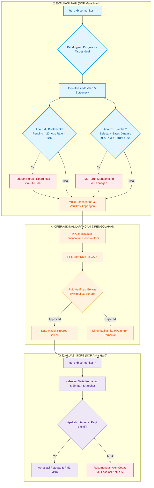

# Sensus Ekonomi 2026 (2026)

## Deskripsi Kegiatan
Sensus Ekonomi 2026 (SE2026) merupakan kegiatan 10-tahunan BPS yang bertujuan untuk menyajikan data dasar seluruh kegiatan ekonomi (kecuali sektor pertanian) di wilayah NKRI. Di tingkat Kabupaten Mempawah, pengorganisasian lapangan dipimpin oleh PJ-Kuda, yang membawahi beberapa PML (Pengawas/Pemeriksa), dan masing-masing PML membawahi beberapa PPL (Pencacah Lapangan).

## Monitoring Progres Lapangan
Guna memastikan kelancaran progres pendataan yang dilakukan oleh PPL serta ketepatan waktu verifikasi oleh PML, telah disediakan utilitas monitoring otomatis.

### Cara Menjalankan Monitoring
Untuk melakukan evaluasi kesehatan progres dan intervensi, jalankan perintah berikut di root repositori:

```bash
# ✅ PERINTAH BAKU (Pagi & Sore) — Laporan 6-Seksi Lengkap
./scripts/kb.py se-monitor -r

# --- Perintah tambahan (jika diperlukan detail lebih) ---
# Ringkasan progres tim Ihza Fikri Zaki Karunia
./scripts/kb.py se-monitor

# Peringkat seluruh PJ-Kuda Kabupaten Mempawah
./scripts/kb.py se-monitor --all-pj

# Daftar intervensi se-kabupaten (tabel mentah)
./scripts/kb.py se-monitor -i

# Ringkasan progres dan peringkat seluruh Kab/Kota di Kalbar
./scripts/kb.py se-monitor --prov
```

### Indikator Kesehatan Progres
Utilitas monitoring mengukur beberapa indikator utama:
1.  **Worked Rate** (Rasio Mulai): `(DRAFT + SUBMITTED + APPROVED) / Target`. Mengukur keaktifan PPL di lapangan.
2.  **Completed Rate** (Rasio Selesai): `(SUBMITTED + APPROVED) / Target`. Rata-rata kabupaten saat ini menjadi acuan batas minimal kesehatan progres.
3.  **Approval Rate** (Rasio Pemeriksaan): `APPROVED / (APPROVED + SUBMITTED)`. Mengukur seberapa aktif PML memeriksa data.
4.  **Target Harian PPL (Target Submit/Hari)**: Jumlah dokumen yang harus disubmit PPL per hari agar selesai pada target internal 15 Agustus 2026.
    $$\text{ppl\_daily\_target} = \text{max}(0.0, \frac{\text{Target} - \text{Completed}}{\text{Sisa Hari}})$$
5.  **Target Harian PML (Target Approve/Hari)**: Jumlah berkas yang harus disetujui PML per hari agar verifikasi selesai pada target internal 15 Agustus 2026.
    $$\text{pml\_daily\_target} = \text{max}(0.0, \frac{\text{Target} - \text{Approved}}{\text{Sisa Hari}})$$

## Catatan Evaluasi & Rencana Intervensi Lapangan
Mengingat **seluruh PML adalah mitra** (bukan staf organik BPS), tantangan utama lapangan adalah komitmen waktu dan kedisiplinan pemeriksaan harian. Oleh karena itu, monitoring pagi & sore menjadi sangat krusial.

### SOP Monitoring Harian (Pagi & Sore)
Proses monitoring telah dibakukan secara harian. Pengguna cukup menanyakan hal berikut pada pagi (sebelum lapangan) dan sore (sebelum pulang kerja):
> **"oke di mana posisi kita hari ini untuk SE 2026 dan apakah ada yang perlu diintervensi agar on target?"** (atau variannya)
> **"bagaimana kondisi SE 2026 mempawah saat ini"** (atau variannya)

Ketika membahas monitoring atau menyajikan laporan progres, asisten AI **wajib** sebisa mungkin menyajikan data dalam bentuk **tabel** demi kejelasan dan keterbacaan informasi. Laporan harian disajikan dengan format baku berikut:

1. **Status Target Harian (Tenggat 15 Agustus 2026)**:
   - **Target Progres Ideal Hari Ini**: `[Expected Progress]%` (Dihitung berdasarkan hari lapangan yang sudah berjalan dari total 61 hari lapangan sejak 15 Juni hingga target selesai 15 Agustus 2026).
   - **Target Harian Kabupaten Mempawah**: PPL wajib submit `[PPL Daily Target]` dokumen/hari dan PML wajib approve `[PML Daily Target]` dokumen/hari secara akumulatif.
2. **Posisi Makro Provinsi Kalbar & Mempawah**:
   - **Progres Kalbar**: `[Progres]%` (Status: `ON TARGET` / `BEHIND TARGET` / `WARNING`).
     - *Estimasi Selesai PPL (Worked)*: `[Tanggal]`
     - *Estimasi Selesai PML (Done)*: `[Tanggal]`
     - *Estimasi Selesai Terlama Kabupaten di Kalbar*: `[Nama Kabupaten]` (`[Tanggal]`)
   - **Progres Mempawah**: `[Progres]%` (Status: `ON TARGET` / `BEHIND TARGET` / `WARNING`).
     - *Estimasi Selesai PPL (Worked)*: `[Tanggal]`
     - *Estimasi Selesai PML (Done)*: `[Tanggal]`
     - *Estimasi Selesai Terlama PPL di Mempawah*: `[Nama PPL]` (PML: `[Nama PML]`, PJ: `[Nama PJ]`) pada `[Tanggal]`
   - **Peringkat Mempawah**: Peringkat `[Rank]` dari 14 Kabupaten/Kota se-Kalbar.
   - **Metode & Formula Kalkulasi Estimasi**: Menjelaskan secara transparan bahwa estimasi dihitung real secara matematis oleh sistem berdasarkan data, bukan menerka-nerka:
     $$\text{Kecepatan Harian} = \frac{\text{Done \%}}{\text{Hari Lapangan Berjalan}}$$
     $$\text{Sisa Hari} = \frac{100\% - \text{Done \%}}{\text{Kecepatan Harian}}$$
     $$\text{Est. Tanggal Selesai} = \text{Hari Ini} + \text{Sisa Hari}$$
3. **Perbandingan dengan Pengecekan Sebelumnya (Delta)**:
   - Menampilkan selisih kenaikan progres Kalbar, Mempawah, dan tim PJ Ihza sejak pengecekan terakhir, serta perubahan antrean PML.
4. **Daftar Intervensi Taktis Mempawah**:
   - **PML Bottleneck**: Daftar PML dengan antrean berkas pending kritis (>20 pending, approval < 20%).
   - **PPL Terlambat**: Daftar PPL dengan progres selesai di bawah batas dinamis (dihitung sebagai $\text{max}(3.00\%, \text{expected\_pct} \times 0.25)$) dan target > 200.
5. **Rekomendasi Taktis untuk Ketua Sensus Ekonomi BPS Kabupaten Mempawah**:
   - Rekomendasi kebijakan tingkat kabupaten (misal: penegakan sanksi/evaluasi kinerja PML Mitra, rapat koordinasi luar biasa, penugasan staf organik) berdasarkan status dan tren bottleneck secara akumulatif.
6. **Rekomendasi Aksi Cepat PJ-Kuda**:
   - Langkah konkret harian untuk PJ-Kuda dalam melakukan pembinaan petugas tim masing-masing.

### SOP Analisis & Perbandingan PML-PPL (Ad-Hoc)
Apabila dilakukan pengecekan mendalam terhadap PML tertentu, laporan wajib disajikan dalam bentuk dua tabel berikut:
1.  **Tabel 1: Perbandingan Makro Kinerja PML**
    *   Kolom: `Dimensi Perbandingan`, `PML TARGET`, `PML PEMBANDING / LAINNYA`, `Rata-rata Kabupaten`.
    *   Metrik wajib: Target unit, Completed Rate (Done %), Rank Completed, Worked Rate (Mulai %), Rank Worked, Approval Rate (Verifikasi %), Antrean Pending, Target Harian (Approve/Hari), dan Status Bottleneck.
2.  **Tabel 2: Detail Kinerja PPL di Bawah PML Terkait**
    *   Kolom: `Nama PPL`, `SLS`, `Target`, `OPEN`, `DRAFT`, `SUBMIT`, `APPROVE`, `Tgt Submit/Hari`, `Done %`, `Est. Selesai`, `Status / Tindakan`.
    *   Diurutkan dari `Done %` terkecil untuk mempermudah identifikasi PPL kritis.
    *   Kolom `Done %` wajib dilengkapi dengan emoji status warna (`🟢`, `🟡`, `🔴`) sesuai kriteria batas dinamis.
3.  **Kueri Petugas Terkritis (Proyeksi Selesai Paling Lama)**
    *   Jika ditanyakan: *"siapa yang kemungkinan paling lama selesainya?"* atau *"siapa petugas paling kritis?"*
    *   **Prosedur**: Jalankan `python3 scratch/run_worst_projections.py`.
    *   **Penyajian**: Tampilkan tabel berisi PPL dengan proyeksi selesai paling lama, diprioritaskan dari petugas yang belum mulai (`done_rate == 0` / `Tdk Terproyeksi`) lalu diurutkan berdasarkan tanggal estimasi selesai terjauh (descending).

## Diagram Alur Monitoring hingga Intervensi

Diagram di bawah ini menggambarkan alur kerja harian terstandarisasi untuk memantau progres lapangan dan mengeksekusi intervensi taktis secara cepat:



### Buku Catatan Intervensi Aktif
*Simpan catatan intervensi taktis (seperti hasil telepon atau kunjungan lapangan) di bagian ini untuk pemantauan berkelanjutan:*
*   **[2026-06-22 Pagi]**: Menemukan bottleneck besar pada PML Prabowo (tim Ihza) yang memiliki 211 kiriman pending (Approval Rate: 7.86%). PPL Nia Satunnisa dan Feri Firdaus juga diidentifikasi terlambat memulai lapangan (< 3% selesai).
*   **[2026-06-28 Pagi]**: Laporan status lapangan terkini:
    *   **PML Abang Handri (690 berkas pending)**: Penyebab approval rate rendah (7.26%) diketahui bukan karena PML tidak aktif. Abang Handri sedang membantu PPL-PPL yang lambat dengan **mendampingi dan menggunakan akun PPL** tersebut untuk mengakselerasi pencacahan. Ini menyebabkan waktu verifikasinya tersita. PJ-Kuda Wantri perlu mengingatkan bahwa prioritas verifikasi harus tetap berjalan paralel agar 690 berkas tidak semakin menumpuk.
    *   **PPL Stepiana (TOHO, 2.18% Done)**: Kendala utama tetap **blank spot sinyal internet** Kecamatan Toho. Telah diarahkan menggunakan fitur **"Simpan sementara ke server"** agar data terhitung sebagai Draft (Worked) dan progres terlihat di dashboard. Strategi ini perlu terus diperkuat dengan arahan ke oase sinyal terdekat untuk sinkronisasi berkala.
    *   **PPL Khairunnisa (SEGEDONG, 4.94% Done)**: Dua faktor sekaligus — (1) **kesulitan memahami konsep isian kuesioner** sehingga banyak dokumen yang disubmit ditolak verifikasi berulang, dan (2) **kondisi personal: anak sakit**, sehingga intensitas lapangan menurun. PML Jamaluddin perlu melakukan pendampingan konsep via video call lebih intensif.
    *   **PPL yang mundur**: Sudah dicarikan pengganti. Status pengganti perlu dipantau onboarding-nya.

### Pedoman Intervensi PJ-Kuda
1.  **Intervensi PML (Bottleneck)**: Hubungi PML yang memiliki antrean berkas tinggi (misal Abang Handri, Seliana, Prabowo). Mintalah mereka melakukan persetujuan massal minimal dua kali sehari (pagi sebelum lapangan, malam setelah entrian masuk).
2.  **Intervensi PPL (Keterlambatan)**: Jika PPL memiliki progres di bawah batas dinamis harian (Batas Merah / Fail), PML terkait harus melakukan *kunjungan pendampingan* ke lapangan untuk memecah kendala teknis (login SSO, sinyal, atau penolakan responden).
3.  **Target Waktu Lapangan**: Meskipun jadwal resmi lapangan berlangsung hingga **31 Agustus 2026**, Ketua Sensus Ekonomi BPS Kabupaten Mempawah menargetkan **seluruh dokumen CAPI selesai disubmit pada 15 Agustus 2026**. Oleh karena itu, percepatan di tingkat PPL dan PML sangat penting untuk dicapai sebelum tenggat waktu internal ini.
4.  **Update Berkala**: Data ditarik otomatis dari Google Sheets **Tarikan 6104** (`Realisasi - 6104.csv`). Gunakan perintah **`./scripts/kb.py se-monitor -r`** setiap pagi dan sore untuk laporan baku 6-seksi. Untuk tabel mentah intervensi, gunakan `./scripts/kb.py se-monitor -i`.

## Kendala Lapangan Spesifik & Karakteristik Wilayah (Segedong / Purun / Toho / Sadaniang)
Berdasarkan diskusi koordinasi antara PJ-Kuda Ihza dan PML Jamaluddin (22 Juni 2026), diidentifikasi beberapa kendala operasional lapangan riil yang bernilai tinggi bagi manajemen:
1.  **Dilema Mitra Baru & Pemahaman Konsep**:
    -   Hampir seluruh PPL di bawah pengawasan PML Jamaluddin adalah **mitra baru** (kecuali Feri Firdaus). Ini menyebabkan adaptasi minggu pertama berjalan lambat.
    -   PPL memiliki semangat tinggi tetapi kesulitan memahami konsep isian kuesioner, sehingga sering melakukan entri asal-asalan yang berujung penolakan verifikasi (*rejection*) berulang.
2.  **Kasus PPL Nia Satunnisa (Stres Lapangan & Hampir Mundur)**:
    -   PPL Nia Satunnisa (progres terendah **1.65%**) sempat syok dengan beban lapangan dan penolakan responden di awal pencacahan, serta berniat mengundurkan diri.
    -   Penanganan PML: Memberikan wilayah terkecil/paling nyaman agar percaya diri terlebih dahulu, dan membimbing secara intensif via *share screen* video call WhatsApp hampir setiap malam.
3.  **Karakteristik Wilayah Purun Sungai Burung**:
    -   Daerah Purun Sungai Burung secara historis diidentifikasi sering mengalami masalah petugas lapangan dan resistensi responden.
4.  **Kekhawatiran Kualitas Data**:
    -   Karena PML terkuras waktunya membimbing konsep dasar PPL baru, terdapat risiko PML kelelahan sehingga kualitas pemeriksaan (*approval*) data menurun. Keseimbangan kuantitas dan kualitas harus dipantau ketat.
5.  **Pendataan Perusahaan Besar (Aquarnass)**:
    -   Entitas besar seperti **Aquarnass** di wilayah Segedong menuntut surat pengantar resmi khusus (IPD/surat pengantar perusahaan) dari BPS Kabupaten Mempawah agar bersedia kooperatif dalam pendataan.
6.  **Daerah Blank Spot Sinyal Internet (Kecamatan Toho & Sadaniang)**:
    -   Kecamatan Toho dan Sadaniang secara historis merupakan wilayah dengan sinyal internet terburuk di Kabupaten Mempawah.
    -   Kendala ini menyebabkan progres PPL di daerah tersebut tidak terdeteksi secara real-time di server. Meskipun PPL sudah melakukan pencacahan offline dalam jumlah besar, data baru terkirim secara bertahap saat mereka mendapatkan sinyal stabil, sehingga progres di dashboard/Google Sheets seringkali terlihat sangat rendah atau diam (delay progress).
    -   **Workaround aktif (28 Jun 2026)**: PPL diarahkan menggunakan fitur **"Simpan sementara ke server"** sehingga data terhitung sebagai Draft di server dan progres terlihat di dashboard meski belum submitted secara penuh.
    -   **Pengecualian Lokal (Oase Internet)**: Walaupun daerah tersebut dikategorikan blank spot secara makro, masih terdapat 1 atau 2 desa di dalam kecamatan tersebut yang memiliki sinyal internet terbatas (hanya cukup untuk berkirim pesan/media ringan via WhatsApp). PPL dapat diarahkan untuk berpindah sementara ke desa-desa oase sinyal ini secara berkala guna melakukan sinkronisasi/unggah data CAPI atau sekadar melaporkan progres cepat ke PML.
    -   Tindakan PJ-Kuda/PML: Jangan terburu-buru menjatuhkan sanksi atau menganggap PPL tidak bekerja. Manfaatkan komunikasi via WhatsApp pada desa-desa oase sinyal tersebut, atau lakukan konfirmasi offline (via telepon biasa/SMS, atau kunjungan tatap muka/koordinasi rutin) untuk memverifikasi jumlah dokumen fisik/lokal di perangkat CAPI mereka.
7.  **Bug Kritis Aplikasi FASIH — Data Hilang Saat Draft/Simpan ke Server** *(Dilaporkan 28 Juni 2026)*:
    -   **Deskripsi Bug**: Banyak dokumen yang sudah di-draft, disimpan lokal, atau disimpan ke server mengalami **kehilangan data kritis** — termasuk data geotagging, nama pengusaha, dan tanda tangan responden — sehingga dokumen tersebut **tidak dapat disubmit** oleh PPL.
    -   **Dampak**: Ini merupakan kendala sistemik berskala kabupaten yang mempengaruhi seluruh PPL, bukan hanya wilayah tertentu. Banyak dokumen yang secara visual sudah "dikerjakan" namun tidak bisa masuk ke antrean submission akibat data hilang ini.
    -   **Tindak Lanjut**: Kendala ini telah **dilaporkan secara resmi ke tim developer FASIH di BPS Pusat**. Menunggu perbaikan dari sisi server dan/atau rilis versi template form yang diperbaiki. Informasi update perbaikan akan diteruskan ke grup WhatsApp petugas begitu tersedia.
    -   **Respons BPS Pusat & Kegagalan Mekanisme Recovery** *(28 Juni 2026)*:
        -   BPS Pusat telah menyediakan **fitur history geotagging** di aplikasi FASIH sebagai mekanisme pemulihan data yang hilang.
        -   Namun, fitur ini **hadir terlambat** — pada saat fitur tersedia dan tim lapangan mencoba menggunakannya, **history geotagging sudah tidak tersedia** (telah terhapus dari server).
        -   Petugas PPL yang terdampak pun **terlanjur melakukan geotagging ulang** secara manual di lapangan untuk menambal data yang hilang.
        -   **Konsekuensi**: Data geotagging yang tersimpan bukan merupakan data asli dari kunjungan pertama, melainkan data ulang. Ini berpotensi menimbulkan pertanyaan tentang integritas data spasial dalam dokumen yang bersangkutan.
        -   **Pembelajaran untuk Protokol ke Depan**: Jika terjadi insiden serupa, langkah pertama adalah segera cek fitur history *sebelum* melakukan geotagging ulang, dan eskalasi ke pusat agar history tidak terhapus dari server.
    -   **Implikasi Monitoring**: Kolom `Worked %` pada dashboard yang tinggi namun `Done %` rendah tidak selalu berarti PPL malas — bisa merupakan dampak dari bug ini. Analisis gap (Worked - Done) harus mempertimbangkan faktor bug FASIH ini sebelum menjatuhkan penilaian negatif pada PPL.
    -   ⚠️ **Catatan Interpretasi Data**: Selama bug ini belum diperbaiki, estimasi tanggal selesai (Est. Selesai) di laporan monitoring kemungkinan lebih pesimistis dari kondisi riil, karena sejumlah dokumen yang sudah dikerjakan belum terhitung sebagai Done.
8.  **Karakteristik Positif Responden Mempawah**:
    -   Berdasarkan pengalaman lapangan tim BPS Mempawah, mayoritas responden di Kabupaten Mempawah bersikap **ramah dan kooperatif** terhadap petugas sensus.
    -   Tingkat keramahan ini jauh lebih baik dibandingkan daerah perkotaan seperti Pontianak dan Singkawang, yang dikenal memiliki tingkat penolakan responden lebih tinggi.
    -   Ini merupakan keunggulan operasional nyata bagi tim BPS Mempawah — hambatan lapangan cenderung bersifat teknis (sinyal, aplikasi) bukan resistensi sosial responden.

## Rekap Kinerja Petugas Termin I (Per 15 Juli 2026 - Frozen)

Tautan Google Sheets: [Kinerja Petugas DashSE (Frozen 15 Juli 2026)](https://docs.google.com/spreadsheets/d/1QWwKu8VMg3jwTW6q1SShMBzS10jkBy6Y4wEd7IDWzb0/edit?gid=1250724426#gid=1250724426)

### Pengumuman Resmi Penyesuaian Kinerja
Berikut adalah informasi/pengumuman resmi terkait Rekap SLS/SubSLS Petugas Termin I pada Dashboard SE2026:
1. **Sumber Data**: Data capaian maupun target petugas bersumber dari FASIH dengan kondisi data per **15 Juli 2026 pukul 24.00**.
2. **Capaian PPL**: Dihitung berdasarkan jumlah assignment berstatus `SUBMITTED BY PENCACAH`.
3. **Capaian PML**: Dihitung berdasarkan jumlah assignment berstatus `APPROVED BY PENGAWAS` atau `REJECTED BY PENGAWAS`. Jika dalam satu Subsls terdapat lebih dari 1 baris PPL maka untuk capaian PML gunakan salah satu baris saja.
4. **Nilai Target**: Merupakan jumlah assignment prelist awal pada subSLS terkini Fasih per 15 Juli 2026 pukul 24.00.
5. **Reassignment**: Satu assignment ditugaskan pada lebih dari satu pencacah, hanya dihitung sebagai capaian PPL yang pertama kali melakukan submit.
6. **Penggantian Petugas**: Jika pernah terjadi penggantian petugas dalam satu Subsls maka akan terdapat dua atau lebih baris petugas pada Subsls tersebut dengan capaian dari masing-masing petugas dan targetnya adalah target satu Subsls.
7. **Penyesuaian Alokasi**: Telah dilakukan penyesuaian target dan capaian untuk SLS/SubSLS yang pernah dilakukan penyesuaian alokasi muatan awal (diperbarui per **17 Juli 2026 pukul 20.15**).

### Analisis Kinerja PML (Sensus Ekonomi 2026 - Termin I)
Berdasarkan data yang dibekukan per 15 Juli 2026, persentase penyelesaian verifikasi PML Kabupaten Mempawah baru berkisar antara **35,99% - 36,03%**, sehingga **belum mencapai target 40%** secara kabupaten.

---

## 💬 Rujukan Komunikasi & Catatan Penting Lapangan (Grup WhatsApp)

### 1. Sumber Informasi Chat Ekspor
*   **Grup Petugas SE2026 Mempawah**: Berkas ekspor obrolan disimpan langsung di folder ini sebagai [WhatsApp Chat with PETUGAS SENSUS EKONOMI 2026 BPS MEMPAWAH.zip](WhatsApp%20Chat%20with%20PETUGAS%20SENSUS%20EKONOMI%202026%20BPS%20MEMPAWAH.zip).
*   **Grup Koordinator Wilayah (Provinsi)**: Terpusat di [data/chats/](file:///c:/projects/knowledge-base/data/chats/) pada berkas [WhatsApp Chat with PIC SPBE KALBAR.zip](../../../data/chats/pic-spbe-kalbar/WhatsApp%20Chat%20with%20PIC%20SPBE%20KALBAR.zip).

### 2. Catatan Operasional Penting Lapangan (Triwulan II 2026)
*   **Cutoff Evaluasi Honor Termin I (Target 40%)**:
    *   *Ketetapan*: Pembayaran honor Termin I mensyaratkan **realisasi capaian pendataan minimal 40%** per **14 Juli 2026 pukul 23.59 WIB**.
*   **Paket Data Tahap 2**:
    *   *Deadline*: Paling lambat **13 Juli 2026 pukul 23.59 WIB** petugas wajib memperbarui nomor paket data mereka di link [s.bps.go.id/paketdatatahap2_6104](https://s.bps.go.id/paketdatatahap2_6104).
    *   *Link Konfirmasi*: Setelah mendaftar, petugas wajib melakukan konfirmasi melalui link [s.bps.go.id/CONFIRM-PAKETDATASE6104](http://s.bps.go.id/CONFIRM-PAKETDATASE6104).
*   **Perbaikan Administrasi Web Sobat Mitra**:
    *   *Instruksi*: Petugas wajib memastikan nama sesuai KTP, NIK terverifikasi (centang hijau ✅), dan nomor rekening aktif (sama dengan pencairan sebelumnya) di [mitra.bps.go.id](https://mitra.bps.go.id).
    *   *Deadline*: **15 Juli 2026 pukul 23.59 WIB**.
*   **Dispensasi Khusus PPL**:
    *   PPL Muhammad Ade Riyadi (wilayah pendataan Sungai Purun Kecil) mengalami duka cita (ayah kandung wafat per 16 Juli 2026). Sisa wilayah tinggal 2 RT dan diberikan permakluman keterlambatan penyelesaian tugas lapangan selama beberapa hari ke depan.
*   **Akses Database FASIH-DATA (NDA & Keamanan Informasi)**:
    *   *Kebijakan*: Untuk menjaga keamanan informasi dan mematuhi UU Pelindungan Data Pribadi (UU PDP), akses ke raw database FASIH-DATA saat ini dinonaktifkan sementara oleh Direktorat SIS.
    *   *Tindakan*: Personel yang terdaftar sebagai Pengguna FASIH DATA wajib mengunduh, menandatangani, dan mengunggah dokumen Non-Disclosure Agreement (NDA) melalui tautan [s.bps.go.id/ndasqllab](https://s.bps.go.id/ndasqllab) agar akses database diaktifkan kembali. Rincian 10 klausul NDA, contoh dokumen Kabupaten Sanggau, dan panduan pengisian selengkapnya dapat dibaca di berkas [nda-fasih-data-se2026.md](nda-fasih-data-se2026.md).

### 3. Struktur Schema Database & SQL Lab (FASIH-DATA)
Bagi pengguna terdaftar yang memerlukan akses query langsung pada database SQL Lab, berikut struktur data yang tersedia:

*   **Schema Survei Sensus Ekonomi 2026 - Usaha Besar (UB)**: **`tcz_37526b20`**
    *   *Tabel Utama*:
        *   `base_table_assignment` → Data dasar penugasan.
        *   `base_table_assignment_region` → Wilayah Sub-SLS.
        *   `base_table_assignment_history` → Riwayat status dokumen.
        *   `base_table_assignment_responsibility` → Alokasi penugasan PPL/PML.
        *   `base_table_user_allocation` → Data alokasi wilayah petugas.
        *   `root_table` → Isian kuesioner utama (di luar roster).
        *   `pusat_nested` → Roster "Keterangan Kantor Cabang/Unit".
*   **Schema Survei Sensus Ekonomi 2026 - Non-UB (Umum)**: **`tgr_fd68e454`**
    *   *Tabel Utama*: Sama dengan tabel schema UB, ditambah:
        *   `pair_label_value_0` & `pair_label_value_1` → Isian pertanyaan bertipe multi-value (luar/dalam roster).
        *   `nested_dtsen` → Roster "Keterangan Anggota Keluarga".
        *   `se2026_nested` → Roster "Keterangan Usaha/Perusahaan".
        *   `nested_dtsen_var` → Roster "Keterangan Sosial Ekonomi Anggota Keluarga".
        *   `kp_nested` → Roster "Kantor Cabang".
        *   `T_USAHA` → *Combined view* gabungan seluruh usaha UB dan non-UB yang kolomnya sudah diseragamkan.
*   **Tautan Rujukan Pengguna**:
    *   *Registrasi & Ganti Akun Admin*: [s.bps.go.id/akun_sqllab_se2026](http://s.bps.go.id/akun_sqllab_se2026) (Provinsi max 2 admin, Kab/Kota max 1 admin).
    *   *Spreadsheet Daftar Admin*: [Spreadsheet Admin SQL Lab Pusat](https://docs.google.com/spreadsheets/d/13lxyohIK_91HSvw7Fi-s56NaHp86GDfDOTPR0cyvTw8/edit?usp=sharing).
    *   *Panduan Teknis FASIH DATA*: [s.bps.go.id/fasih_data_se2026](http://s.bps.go.id/fasih_data_se2026).

### 4. Kebijakan Penanganan Anomali & Penilaian Ukuran Kualitas (UK)
Kebijakan penanganan missing values, anomali, dan indikator didasarkan pada Surat Dinas Resmi No. **B-69/07000/PR.100/2026** per tanggal 14 Juli 2026. (Salinan lengkap berkas dapat dibaca pada [surat-penanganan-anomali-kualitas-data-se2026.md](surat-penanganan-anomali-kualitas-data-se2026.md)).

Berikut rangkuman ketentuan teknis penanganan kualitas data:
*   **Ketentuan Missing Values**:
    *   *Pendapatan & Pengeluaran*: Wajib diselesaikan di lapangan dengan revisit dan *probing* responden.
    *   *Nilai Aset*: Harus terisi sesuai interval/kategori. Finalisasi missing value diselesaikan oleh BPS Pusat pasca-lapangan.
    *   *NIK Kosong*: Diperbaiki dengan menanyakan ke keluarga lain/Ketua RT, mencocokkan dengan DTSEN kependudukan, atau jika tetap tidak ketemu, wajib mencantumkan **catatan tertulis** di Blok Catatan bahwa koordinasi RT sudah dilakukan.
*   **Ketentuan Anomali Data**:
    *   Diselesaikan melalui revisit dengan melakukan koreksi data riil ATAU menulis penjelasan di Blok Catatan bahwa data sudah sesuai kondisi sebenarnya.
    *   Prosedur tindak lanjut anomali data merujuk pada: [s.bps.go.id/panduan-anomali](http://s.bps.go.id/panduan-anomali).
*   **Ketentuan Ketidakwajaran Indikator**:
    *   BPS Kabupaten wajib memantau 10 indikator di Card Kualitas Data terhadap data pembanding makro (PDRB 2025 untuk NTB, Sakernas Agustus 2025 untuk Tenaga Kerja) hingga level SLS.
    *   Daftar perbandingan NTB sementara nasional dapat diakses di: [s.bps.go.id/Perbandingan_NTB_SE2026](http://s.bps.go.id/Perbandingan_NTB_SE2026).
*   **Mekanisme Penghapusan**: Anomali yang sudah diperbaiki akan **langsung hilang dari dashboard** (tidak berubah status menjadi "ditindaklanjuti").
*   **Perubahan Dasar Perhitungan UK 4/5**:
    *   Akibat penyesuaian sistem pemrosesan ulang data oleh SIS pada 6 Juli, data anomali 30 Juni tidak lagi dapat digunakan.
    *   *Formula Baru*: Jumlah anomali yang ditindaklanjuti per **9 Juli 2026 (kumulatif)** dibandingkan dengan total anomali yang muncul per **6 Juli 2026 (kumulatif)**.
    *   *Penilaian UK 6/7/8* (Kelengkapan identitas/NIK) tetap mengacu pada target data per **9 Juli 2026**.
*   **Folder Anomali Kalbar**: Unduhan berkas excel anomali per kabupaten di Kalbar disediakan di [Google Drive Anomali Kalbar](https://drive.google.com/drive/folders/1I1yAJKe6CmqVTj0IELjfxTFj180564r_?usp=sharing) (diperbarui berkala oleh Provinsi).

### 5. Sejarah Pembaruan Versi Aplikasi & Validasi SE2026
*   **Fasih Mobile v2.16.4 & Template v4.9.2 (25 Juni 2026)**: Rilis pembaruan awal penugasan.
*   **Template v5.1.1 (06 Juli 2026)**: Penambahan kode *Data diperoleh dari KP* untuk kantor pusat, perbaikan alur *Tidak Eligible*, warning rules SOSEK (nama KK = P, umur KK < 10th, profesi PPPK, air sumur rusun, daya listrik <900W tapi ada kulkas/AC).
*   **Template v5.3.0 (08 Juli 2026)**: Perbaikan nama usaha strip, total aset/pendapatan tidak tampil. **Penghapusan rincian tanda tangan** (diganti ceklist pernyataan).
    *   *Solusi Data Strip*: Buka kuesioner draft lalu isi ulang. Untuk yang sudah submit, PML harus mengedit isian kuesioner agar data strip tampil kembali.
*   **Template v5.4.1 (13 Juli 2026)**: Aturan email bisa diisi strip (-).
    *   *Ngibar UB*: Status *Submitted by Responden* langsung **EDIT by Admin** (tidak perlu assign petugas). Jika terlanjur assign, approved by PML dahulu.
    *   *Ngibar UM UMK*: Status *Submitted by Responden* **wajib direject oleh PML** untuk diisi nomor bangunan dan geotagging secara CAPI harian.
*   **Fasih Mobile v2.16.6 (11 Juli 2026)**: Penambahan fitur dekripsi online, samakan versi code, switch mode ke CAWI via WA.
*   **Fasih Mobile v2.16.7 & Template v5.5.0 (16 Juli 2026)**: Rilis CAWI Keluarga (unique link switch mode), perbaikan sql injection lookup, perbaikan bug logout, dan penetapan jeda minimum kunjungan I, II, III selama **4 jam**.
## 🛠️ Solusi Teknis & Kendala Lapangan Terintegrasi (Troubleshooting Guide)

Berikut adalah rekapitulasi kendala teknis harian yang dihadapi oleh Petugas Lapangan (PPL/PML) beserta solusinya berdasarkan hasil koordinasi tim IT (grup Halojis & PIC SPBE):

| No | Masalah Petugas Lapangan (Dari Chat Petugas) | Rincian & Dampak | Solusi & Penjelasan Teknis (Dari Chat PIC SPBE & Halojis) |
|---|---|---|---|
| **1** | **Kehilangan Data Draft saat Ganti Akun / Logout** | Petugas yang keluar (*logout*) lalu masuk (*login*) menggunakan akun lain mengalami kehilangan seluruh isian kuesioner yang berstatus `DRAFT`. | **Penyebab**: Aplikasi membersihkan berkas lokal saat berganti profil pengguna.<br>**Solusi**: Jangan pernah ganti akun/login akun lain jika masih ada `DRAFT`. Selesaikan dan *submit* terlebih dahulu semua data draft. Logout-login menggunakan akun yang **sama** aman dan tidak menghapus draft. |
| **2** | **Hilangnya Tombol "Simpan Draft ke Server"** | Petugas kebingungan mencari tombol manual untuk menyimpan cadangan draft ke server cloud. | **Penyebab**: Tombol tersebut telah dihapus secara resmi oleh BPS Pusat.<br>**Solusi**: Sistem cloud mengotomatiskan ini. PPL cukup membuka kuesioner dan memilih opsi **"Simpan Sementara"** saat terhubung ke internet, maka data akan otomatis tersinkronisasi ke server pusat. |
| **3** | **Data Draft Hilang / Rusak Akibat Menghapus (*Uninstall*) Aplikasi** | Petugas melakukan *uninstall* aplikasi untuk mengatasi error/bug, namun data draft hilang secara permanen meskipun sudah di-*backup*. | **Solusi**: **DILARANG KERAS** melakukan *uninstall* aplikasi FASIH Mobile jika masih memiliki data berstatus `DRAFT` (karena fitur backup-restore hanya mencakup data tertentu, bukan status draft offline lokal). |
| **4** | **Sinyal Hilang / Blank Spot di Wilayah Terpencil (misal Kecamatan Toho)** | Pemadaman listrik atau ketiadaan pemancar menyebabkan petugas tidak bisa melakukan sinkronisasi template dan mengirim berkas (*submit*). | **Solusi**: PPL dan PML menjadwalkan **1 hari khusus** berkumpul bersama di satu titik yang memiliki akses internet stabil ("oase sinyal") untuk melakukan: (a) *Backup* data harian, (b) *Sync* template bersama, dan (c) melakukan proses *submit* massal ke server. |
| **5** | **Isian Kuesioner Berubah Menjadi Strip (`-`) / Tidak Tampil (Aset & Total Pendapatan)** | Setelah adanya pembaruan aplikasi, beberapa isian data yang sudah disubmit atau di-draft mendadak kosong/strip. | **Solusi (Rilis Template v5.3.0)**: <br>1. Update aplikasi FASIH Mobile dan Form Engine ke versi terbaru.<br>2. Untuk kuesioner *belum submit*, buka kembali dokumen draft lalu isi ulang kolom yang kosong.<br>3. Untuk yang *sudah submit*, PML pengawas harus melakukan **edit isian** pada akun pengawas mereka untuk memicu tampilan data yang tersembunyi. |
| **6** | **Validasi Alamat Email Mengalami Error / Galat** | Petugas memasukkan tanda hubung/strip (`-`) untuk responden yang tidak memiliki email, namun sistem mendeteksi error validasi sehingga dokumen tertahan di PML. | **Solusi (Rilis Template v5.4.1)**: <br>1. BPS Pusat memperbarui rule validasi sehingga email bisa menerima tanda strip (`-`).<br>2. Untuk dokumen lama yang telanjur *galat*, PML harus mereject dokumen tersebut agar PPL memperbaikinya di aplikasi (disarankan **dikosongkan saja** jika tidak memiliki email, daripada diisi strip). |
| **7** | **Nama Pengusaha / Usaha Hilang Misterius di HP Petugas** | Data prelist nama pengusaha kosong di aplikasi, mencegah petugas melanjutkan pendataan. | **Solusi**: Lakukan backup, hapus cache, lalu *sync* template di wilayah yang sinyalnya bagus. Jika nama tetap hilang, PML harus melakukan **reject massal** terhadap Sub-SLS tersebut untuk memicu tarikan ulang prelist data secara bersih oleh sistem, lalu PPL mengedit ulang. |
| **8** | **Ngibar UB (Usaha Besar) vs Ngibar UM UMK Hasil Responden** | Kebingungan petugas terkait tindakan yang harus diambil untuk hasil isian mandiri (Ngibar) yang masuk ke daftar tugas. | **Solusi (Rilis Template v5.4.1)**:<br>1. **Ngibar UB**: Status *Submitted by Responden* langsung **EDIT by Admin Kabupaten** (tidak perlu ditugaskan ke PPL). Jika telanjur di-assign, PML cukup klik *Approve*.<br>2. **Ngibar UM UMK**: Status *Submitted by Responden* **wajib direject oleh PML** ke PPL, agar PPL melakukan verifikasi lapangan untuk mengisi nomor bangunan dan geotagging. |

## 🔍 6. Analisis Pemutakhiran Keluarga & Deteksi Moral Hazard

Progres pemutakhiran keluarga dipantau secara berkala melalui Google Sheets: [Pemutakhiran Keluarga (Real-time)](https://docs.google.com/spreadsheets/d/1QWwKu8VMg3jwTW6q1SShMBzS10jkBy6Y4wEd7IDWzb0/edit?gid=51144941#gid=51144941).

### A. Rangkuman Progres Kabupaten Mempawah (Per 20 Juli 2026)
*   **Total Target Keluarga (Prelist Awal)**: 89.072 keluarga.
*   **Keluarga Ditemukan**: 31.029 (34.84%).
*   **Keluarga Baru**: 4.343 keluarga.
*   **Keluarga Meninggal**: 1.071 (1.20%).
*   **Tidak Eligible**: 47 (0.05%).
*   **Tidak Dapat Ditemui**: 0 (0.00%).
*   **Tidak Ditemukan**: 12.161 (13.65%).

---

### B. Kerangka Deteksi Moral Hazard (Shortcut Data)
Moral hazard terjadi ketika petugas PPL secara sengaja melaporkan keluarga dengan status **"Tidak Ditemukan"**, **"Meninggal"**, atau **"Tidak Eligible"** tanpa melakukan kunjungan fisik ke lapangan. Hal ini dilakukan demi mempercepat progres penyelesaian beban wilayah karena status-status ini tidak memerlukan pengisian kuesioner karakteristik ekonomi yang panjang.

Metode pengolahan data paling pintar untuk mendeteksi moral hazard ini meliputi:
1.  **Outlier Analisis Z-Score**:
    *   Hitung rasio $\frac{\text{Tidak Ditemukan}}{\text{Prelist}}$ untuk setiap PPL.
    *   Tentukan rata-rata ($\mu$) dan standar deviasi ($\sigma$) untuk PPL dengan beban kerja representatif (prelist $\ge 50$ KK) guna menyaring gangguan variasi acak (noise).
    *   PPL yang memiliki Z-score $> 1.5$ atau $> 2.0$ diidentifikasi sebagai **Anomali Kritis**.
    *   *Kondisi Mempawah saat ini*: Rata-rata kabupaten $\mu = 13.58\%$, standar deviasi $\sigma = 6.61\%$. Batas anomali kritis ($+2\sigma$) adalah **$26.81\%$**.
2.  **Uji Konsistensi Spasial (Neighborhood Peer Comparison)**:
    *   Membandingkan persentase "Tidak Ditemukan" milik seorang PPL terhadap rata-rata PPL lain di **kecamatan yang sama**. Wilayah rural dengan mobilitas tinggi tentu berbeda dengan wilayah urban/perumahan baru, sehingga perbandingan berbasis kecamatan jauh lebih adil dan akurat.
3.  **Korelasi "Tidak Ditemukan" vs "Keluarga Baru"**:
    *   Petugas yang melakukan moral hazard (malas menjelajah wilayah) umumnya akan memiliki penambahan **Keluarga Baru mendekati 0%**, karena mereka mengabaikan proses sweeping fisik di lapangan.
4.  **Revisit Pengawasan Terarah (Targeted Revisit)**:
    *   PML diinstruksikan melakukan kroscek lapangan acak (sampling minimal 3-5 keluarga) khusus pada SLS yang dikelola oleh PPL dengan tingkat anomali tinggi.

---

### C. Daftar PPL dengan Tingkat Anomali "Tidak Ditemukan" Tertinggi (Outliers)
Berdasarkan hasil pengolahan data alokasi dan realisasi pemutakhiran keluarga per **20 Juli 2026**, berikut adalah PPL dengan Z-score di atas $+1.5\sigma$ ($> 23.50\%$) yang sangat direkomendasikan untuk diawasi ketat dan dilakukan *revisit* oleh PML masing-masing:

| No | Nama PPL | Kecamatan | PML Pengawas | Prelist | Tidak Ditemukan | % Tidak Ditemukan | Z-Score / Kategori |
|---|---|---|---|---|---|---|---|
| 1 | **ANDI SAPUTRA** | MEMPAWAH HILIR | NELLY NALITA | 455 | 266 | **58.46%** | $> +6\sigma$ (Sangat Kritis) |
| 2 | **GERHAN LANTARA RYANDI** | MEMPAWAH HILIR | ZAINI | 526 | 173 | **32.89%** | $> +2.9\sigma$ (Kritis) |
| 3 | **FATMAWATI** | SUNGAI PINYUH | YUDI WAHYUDI | 313 | 92 | **29.39%** | $> +2.3\sigma$ (Anomali) |
| 4 | **ROHMI** | MEMPAWAH HILIR | ZAINI | 211 | 62 | **29.38%** | $> +2.3\sigma$ (Anomali) |
| 5 | **BEYYINAH** | SUNGAI PINYUH | MAT TOHIR | 501 | 147 | **29.34%** | $> +2.3\sigma$ (Anomali) |
| 6 | **HEFRRY AUGUSTRIO** | SADANIANG | SELIANA | 354 | 99 | **27.97%** | $> +2.1\sigma$ (Anomali) |
| 7 | **LARAS NANDA JULITA** | SUNGAI PINYUH | SULIS TRI HANDAYANI | 546 | 148 | **27.11%** | $> +2.0\sigma$ (Batas Kritis $+2\sigma$) |
| 8 | **STEPIANA** | TOHO | HANDOKO TUAH S. | 325 | 86 | **26.46%** | $> +1.9\sigma$ (Batas Kritis) |
| 9 | **EVA LUTFIANTI** | SUNGAI PINYUH | SULIS TRI HANDAYANI | 507 | 129 | **25.44%** | $> +1.7\sigma$ (Anomali Ringan) |
| 10 | **IMAMUL AKHYAR** | MEMPAWAH HILIR | NELLY NALITA | 540 | 137 | **25.37%** | $> +1.7\sigma$ (Anomali Ringan) |
| 11 | **WILHELMINA HALIM** | SUNGAI KUNYIT | YUYUN ANTONI,SE | 485 | 123 | **25.36%** | $> +1.7\sigma$ (Anomali Ringan) |
| 12 | **FAIRUZ RESTU SADEWO** | MEMPAWAH HILIR | ZAINI | 411 | 102 | **24.82%** | $> +1.7\sigma$ (Anomali Ringan) |

*Catatan: PPL Andi Saputra menunjukkan deviasi ekstrem ($> 6\sigma$). PML Nelly Nalita wajib segera turun tangan mengevaluasi kebenaran isian lapangan di wilayah tugas Andi Saputra.*

