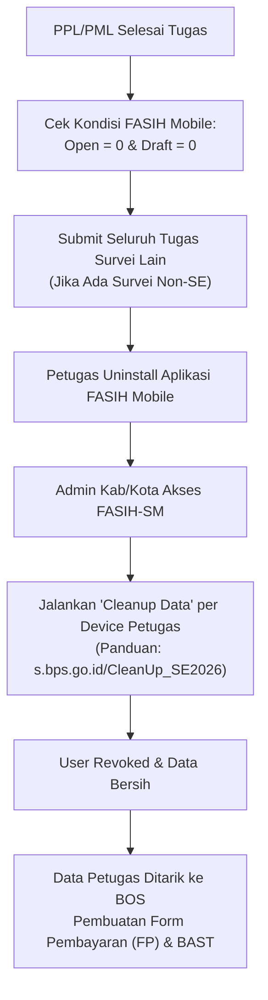

# 🧹 Mekanisme Cleanup Assignment FASIH, Alokasi Petugas & Syarat Pembayaran Honor SE2026

Dokumen ini mendokumentasikan SOP resmi dan petunjuk teknis terkait **Cleanup Data/Assignment Aplikasi FASIH**, **Tata Cara Pergantian Role Petugas**, serta **Integrasi dengan BOS & SOBAT** untuk pembayaran honor petugas Sensus Ekonomi 2026 (SE2026) BPS Kabupaten/Kota.

---

## 1. 📅 Jadwal Maintenance & Akses Server FASIH (September 2026)

- **15–16 September 2026**: Beban server FASIH sangat tinggi akibat akses serentak nasional.
- **16 September 2026**: Server FASIH ditutup sementara untuk proses **backup data menyeluruh**.
- **17 September 2026**: Server FASIH dibuka kembali secara normal untuk operasional lapangan lanjutan, evaluasi data, dan administrasi penyelesaian.

---

## 2. 🫧 Mekanisme Cleanup Data & Assignment Aplikasi FASIH

### A. Tujuan & Urgensi
1. **Revoke Hak Akses**: Memastikan petugas yang telah selesai masa kontraknya tidak dapat lagi mengakses atau melakukan sinkronisasi data SE2026 pada perangkatnya, meskipun aplikasi FASIH di-install ulang.
2. **Syarat Pencairan Honor di BOS (BPS Operating System)**: Data petugas SE yang berstatus "Clean" di FASIH-SM merupakan syarat mutlak agar data petugas dapat ditarik ke aplikasi BOS pada tahap pembuatan **Form Pembayaran (FP)** honor petugas dan Berita Acara Serah Terima (BAST).
3. **Integrasi Sistem**: Status cleanup ini terhubung langsung antara **FASIH-SM**, **SOBAT**, dan **BOS**.

### B. Tahapan Eksekusi Baku

1. **Pemeriksaan Status Tugas Sebelum Uninstall**:
   - Pastikan kondisi pada FASIH Mobile petugas: `Open = 0` dan `Draft = 0`.
   - ⚠️ **PERINGATAN KRITIS**: Berkas draft yang masih berstatus lokal (warna abu-abu) **AKAN HILANG PERMANEN** jika aplikasi di-uninstall sebelum disubmit ke server!
   - Jika petugas juga ditugaskan pada survei lain di luar SE2026, **wajib submit seluruh assignment survei lain tersebut terlebih dahulu**.

2. **Uninstall Aplikasi FASIH oleh Petugas**:
   - Petugas menghapus/meng-uninstall aplikasi FASIH dari smartphone masing-masing.

3. **Eksekusi Cleanup Data oleh Admin Kab/Kota**:
   - Admin Kab/Kota masuk ke portal **FASIH-SM**.
   - Lakukan **Cleanup Data** untuk setiap device yang terdaftar milik petugas bersangkutan.
   - Panduan teknis resmi dapat diakses di: [http://s.bps.go.id/CleanUp_SE2026](http://s.bps.go.id/CleanUp_SE2026) atau melalui menu *Documentation FASIH-SM*.

4. **Catatan Petugas Usaha Besar (UB) vs Door-to-Door (D2D)**:
   - Untuk petugas UB, setelah dinilai dan di-cleanup di FASIH-SM, sinkronisasi ke tab "Selesai" Manajemen Mitra/BOS perlu dipantau berkala hingga status cleanup terverifikasi.

---

## 3. 🔄 Tata Cara Pergantian Role Petugas (PML ke PPL) di FASIH-SM

Jika dalam fase penyisiran atau evaluasi lanjutan terdapat petugas PML yang dialihkan menjadi PPL, lakukan prosedur berikut agar tidak terjadi konflik penugasan wilayah/sub-SLS:

1. **Pelepasan Assignment PML**:
   - Ganti penugasan user tersebut dengan akun lain melalui opsi **Assign Ulang (dengan ganti petugas)** pada seluruh assignment yang sebelumnya dipegang oleh user bersangkutan.
   - Hapus user petugas tersebut dari daftar melalui menu `Petugas`.
2. **Unggah Alokasi Baru**:
   - Upload berkas alokasi petugas baru dengan role yang baru (PPL).
3. **Penugasan Wilayah Kerja**:
   - Lakukan assign petugas (dengan ganti petugas) sesuai wilayah kerja/sub-SLS baru yang dialokasikan.

> [!NOTE]
> **Pembaruan Fitur FASIH-SM**:
> Tim pengembang FASIH pusat sedang menyiapkan fitur menu **Delete User Langsung** (tanpa perlu mengganti assignment satu per satu) khusus bagi akun petugas yang telah berstatus *Clean Up*.

---

## 4. 🛟 Manajemen Petugas Periode 17–30 September 2026

- Berlaku untuk penyesuaian lapangan, penyisiran lanjutan, dan perbaikan kualitas anomali.
- Jika terdapat kendala administrasi role (misal akun PML asli terkunci di sub-SLS penyisiran), penugasan dan pertanggungjawaban pembayaran (termasuk biaya transportasi lokal/translok) dapat dikoordinasikan bersama tim administrasi keuangan satker.
