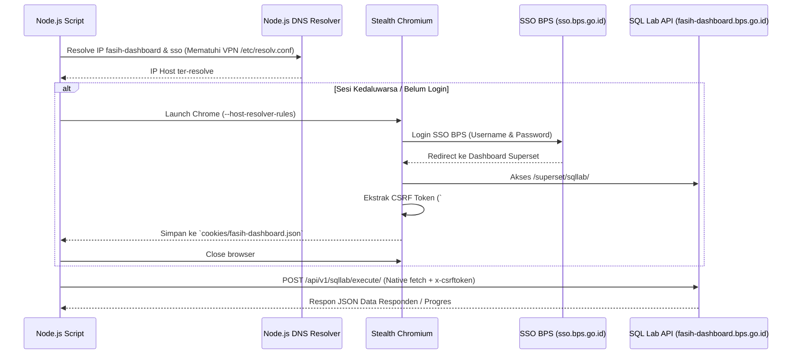

# Panduan Integrasi Superset SQL Lab & Kamus Data FASIH Sensus Ekonomi 2026

Dokumen ini mendokumentasikan mekanisme teknis penarikan data, aturan & limitasi eksekusi query, strategi eksekusi paralel, serta kamus data (Data Dictionary) database FASIH Sensus Ekonomi 2026 (Superset SQL Lab BPS).

---

## 1. ⚙️ Spesifikasi & Parameter Database

* **Dashboard URL**: `https://fasih-dashboard.bps.go.id`
* **SQL Execution Endpoint**: `POST https://fasih-dashboard.bps.go.id/api/v1/sqllab/execute/`
* **Database Engine**: StarRocks / Trino Superset
* **Database ID**: `25`
* **Schema**: `tgr_fd68e454`
* **Survey Period ID**: `fd68e454-ba45-4b85-8205-f3bf777ded24`

---

## 2. ⚠️ Aturan & Limitasi Kritis Superset SQL Lab

Saat menyusun dan mengeksekusi query SQL pada Superset SQL Lab API, **wajib** mematuhi 5 limitasi teknis berikut:

| Limitasi | Ketentuan & Batasan | Solusi / Penanganan |
| :--- | :--- | :--- |
| **Batas Baris (Max Rows)** | Maksimal **1.000 baris** per query request (`queryLimit: 1000`). | Gunakan paginasi chunking dengan `LIMIT 1000 OFFSET {n}`. |
| **Larangan `SELECT *`** | Wildcard `SELECT *` **dilarang keras** dan ditolak server dengan error `Selecting all columns or using wildcard '*' is not allowed in SQL Lab.`. | Sebutkan nama kolom secara spesifik (misal: `SELECT assignment_id, level_2_name ...`). |
| **Batas Maksimal Kolom** | Maksimal **25 kolom** per SELECT query call. | Pilih hanya kolom-kolom yang relevan dengan kebutuhan analisis (jangan melebihi 25 kolom dalam 1 SQL statement). |
| **Client ID Unik** | Parameter `client_id` pada payload POST **wajib alfanumerik 10 karakter unik** per request. | Hasilkan `client_id` acak secara dinamis (contoh: `Math.random().toString(36).substring(2, 12)` di JS atau `uuid.uuid4().hex[:10]` di Python). Jika statis, server mereturn `HTTP 500: Create failed`. |
| **Kuota Rate Limit (HTTP 429)** | Maksimal **300 query request per hari** per akun SSO (`HTTP 429 Too Many Requests: 300 per 1 day`). | Hemat kuota dengan agregasi `GROUP BY` di server-side, terapkan Caching lokal (`results/`), dan penanganan Retry dengan Exponential Backoff. |
| **Keterbatasan Data Status OPEN** | Replikasi OLTP FASIH ke StarRocks/Trino SQL Lab **hanya mereplikasi data yang minimal pernah berstatus DRAFT** (pernah disimpan ke server). Assignment berstatus `OPEN` (belum disentuh PPL) **TIDAK ADA** di SQL Lab. | Jangan gunakan `COUNT(assignment_id)` di SQL Lab sebagai total target acuan utama (karena akan *under-count* target & *over-inflate* persentase selesai). Gunakan master file `Alokasi Petugas.csv` untuk total target, dan gunakan SQL Lab untuk menghitung jumlah worked/submitted/approved/microdata anomali. |

---

## 3. 🔐 Mekanisme Autentikasi & Alur Eksekusi



### Catatan Teknis Setup Jaringan Intranet
1. **Resolusi DNS Intranet Linux**: VPN FortiClient pada Linux mengonfigurasi DNS internal di `/etc/resolv.conf`. Chromium sering kali me-bypass ini. Solusinya, panggil `dns.promises.resolve4()` dari Node.js lalu pasang flag Chrome: `--host-resolver-rules="MAP fasih-dashboard.bps.go.id <IP_DASHBOARD>, MAP sso.bps.go.id <IP_SSO>"`.
2. **TLS Security Flag**: Gunakan `process.env.NODE_TLS_REJECT_UNAUTHORIZED = "0"` untuk menangani sertifikat internal BPS.

---

## 4. ⚡ SOP & Best Practices Implementasi Request SQL Lab

Untuk memastikan penarikan data berjalan stabil tanpa melanggar rate-limit `HTTP 429` (300 req/hari) maupun memicu `HTTP 500`:

### Prinsip Utama Implementasi:
1. **Generasi `client_id` Dinamis**:
   Setiap HTTP POST ke `/api/v1/sqllab/execute/` wajib memiliki `client_id` acak 10 karakter baru.
2. **Penanganan Rate Limit (HTTP 429 & Backoff)**:
   Jika server merespon dengan status `429`, skrip wajib melakukan *pause* (sleep) beberapa detik/menit dengan Exponential Backoff sebelum mencoba kembali (*retry*), daripada langsung menghentikan eksekusi atau memborbardir server.
3. **Klausula `ORDER BY` Deterministik pada Paginasi**:
   Setiap query chunking paralel `LIMIT ... OFFSET ...` **wajib menyertakan `ORDER BY` deterministik** pada kolom unik (misal: `ORDER BY level_6_full_code ASC, current_user_username ASC`) agar penggabungan chunk 100% konsisten tanpa data ganda atau terlewat.
4. **Strategi Caching Lokal**:
   Simpan hasil query ke file lokal (misal `results/sqllab_cache.json`). Sebelum mengirim request ke API, periksa apakah cache lokal masih valid agar menghemat kuota harian.

---

### Contoh Implementasi Robust Node.js (Dengan Retry & Backoff)

```javascript
import { readFileSync, writeFileSync, existsSync } from "fs";

/**
 * Generasi client_id acak 10 karakter alfanumerik
 */
function generateClientId() {
  return Math.random().toString(36).substring(2, 12);
}

/**
 * Eksekusi single query SQL dengan Retry Logic & Handling HTTP 429
 */
async function executeSqlLabQuery(sql, cookieStr, csrfToken, maxRetries = 3) {
  const payload = {
    client_id: generateClientId(), // WAJIB 10 karakter unik
    database_id: 25,
    json: true,
    runAsync: false,
    schema: "tgr_fd68e454",
    sql: sql,
    sql_editor_id: "950527",
    tab: "SQL Execution",
    select_as_cta: false,
    ctas_method: "TABLE",
    queryLimit: 1000, // Max 1000 baris
    expand_data: true
  };

  for (let attempt = 1; attempt <= maxRetries; attempt++) {
    try {
      const res = await fetch("https://fasih-dashboard.bps.go.id/api/v1/sqllab/execute/", {
        method: "POST",
        headers: {
          "accept": "application/json",
          "content-type": "application/json",
          "x-csrftoken": csrfToken,
          "cookie": cookieStr,
          "user-agent": "Mozilla/5.0 (Windows NT 10.0; Win64; x64)"
        },
        body: JSON.stringify(payload)
      });

      // Handling Rate Limit HTTP 429
      if (res.status === 429) {
        const backoffSec = attempt * 10; // 10s, 20s, 30s...
        console.warn(`[HTTP 429] Rate limit tercapai (Max 300 req/hari). Menunggu ${backoffSec}s sebelum retry...`);
        await new Promise(resolve => setTimeout(resolve, backoffSec * 1000));
        payload.client_id = generateClientId(); // Regenerate client_id baru per retry
        continue;
      }

      if (!res.ok) {
        const errorText = await res.text();
        throw new Error(`HTTP ${res.status}: ${errorText}`);
      }

      const json = await res.json();
      return json.data || [];
    } catch (err) {
      if (attempt === maxRetries) throw err;
      console.warn(`[Attempt ${attempt}/${maxRetries} Failed]: ${err.message}. Retrying...`);
      await new Promise(resolve => setTimeout(resolve, 3000));
    }
  }
}

/**
 * Paginasi Chunking Deterministik Paralel
 */
async function fetchAllChunks(cookieStr, csrfToken, totalLimit = 3000) {
  const chunkSize = 1000;
  const allData = [];

  for (let offset = 0; offset < totalLimit; offset += chunkSize) {
    // WAJIB: Kolom spesifik (Tanpa SELECT *), max 25 kolom, ORDER BY deterministik
    const sql = `
      SELECT 
        level_2_name,
        level_6_full_code,
        current_user_username,
        current_user_survey_role_name,
        COUNT(assignment_id) AS total_target,
        COUNT(CASE WHEN assignment_status_alias = 'SUBMITTED BY Pencacah' THEN 1 END) AS submitted_pencacah,
        COUNT(CASE WHEN assignment_status_alias = 'APPROVED BY Pengawas' THEN 1 END) AS approved_pengawas
      FROM base_table_assignment
      WHERE level_2_full_code = '6104'
      GROUP BY level_2_name, level_6_full_code, current_user_username, current_user_survey_role_name
      ORDER BY level_6_full_code ASC, current_user_username ASC
      LIMIT ${chunkSize} OFFSET ${offset}
    `;

    console.log(`[Fetching Chunk] Offset: ${offset}...`);
    const rows = await executeSqlLabQuery(sql, cookieStr, csrfToken);
    allData.push(...rows);

    if (rows.length < chunkSize) break; // Selesai jika baris yang diterima < 1000
  }

  console.log(`[Success] Total ditarik: ${allData.length} baris.`);
  return allData;
}
```

---

## 5. 📖 Kamus Data (Data Dictionary) Utama SE 2026

Rujukan skema database lengkap 12 tabel dengan 1.000+ variabel dan contoh nilai (*sample data*) didokumentasikan secara terpisah pada **[Kamus Data Resmi FASIH SE2026 (data-dictionary-se2026.md)](file:///home/ihza/Projects/knowledge-base/kegiatan/sensus-ekonomi-2026/2026/docs/data-dictionary-se2026.md)**.

Empat tabel utama yang paling sering digunakan untuk monitoring dan ekstraksi responden adalah:

### A. Tabel `base_table_assignment` (Agregasi Progres & Petugas)

| Nama Kolom | Tipe Data | Keterangan |
| :--- | :--- | :--- |
| `assignment_id` | VARCHAR | UUID Unik penugasan pencacahan |
| `level_1_full_code` | VARCHAR | Kode Wilayah Provinsi (2-digit, misal: `61`) |
| `level_2_full_code` | VARCHAR | Kode Wilayah Kabupaten/Kota (4-digit, misal: `6104`) |
| `level_2_name` | VARCHAR | Nama Kabupaten/Kota (misal: `MEMPAWAH`) |
| `level_5_full_code` | VARCHAR | Kode Wilayah SLS 14-digit |
| `level_6_full_code` | VARCHAR | Kode Wilayah Sub-SLS 16-digit |
| `current_user_username` | VARCHAR | Username SSO Petugas aktif yang memegang dokumen |
| `current_user_survey_role_name` | VARCHAR | Peran Petugas (`Pencacah`, `Pengawas`, `Admin Kabupaten`) |
| `assignment_status_alias` | VARCHAR | Status dokumen (`DRAFT`, `OPEN`, `SUBMITTED RESPONDENT`, `SUBMITTED BY Pencacah`, `APPROVED BY Pengawas`, `REJECTED BY Pengawas`, `REVOKED BY Pengawas`, `COMPLETED BY Admin Kabupaten`, `EDITED BY Admin Kabupaten`, `EDITED BY Pengawas`, `REJECTED BY Admin Kabupaten`, `REVOKED BY Admin Kabupaten`) |

---

### B. Tabel `se2026_nested` (Data Mentah Responden / Usaha - 773 Variabel)

Variabel kuesioner disimpan dalam format **berpasangan**: `{nama_var}_value` (nilai mentah/kode) dan `{nama_var}_label` (label deskriptif).

#### 1. Identitas & Legalitas Usaha
* `nama_usaha` (VARCHAR) : Nama Usaha / Perusahaan
* `nama_komersial` (VARCHAR) : Nama Komersial / Merek Dagang
* `alamat_usaha` (VARCHAR) : Alamat Usaha Lengkap
* `kode_keberadaan_usaha` (VARCHAR) / `keberadaan_usaha_label` (VARCHAR) : Status Keberadaan Usaha (1 = Ditemukan, 2 = Tidak Ditemukan)
* `jenis_usaha_value` / `jenis_usaha_label` : Jenis Usaha (Utama / Cabang / UMK)
* `badan_usaha_value` / `badan_usaha_label` : Bentuk Badan Usaha (PT, CV, Koperasi, Perorangan, dll.)
* `kbli_value` / `kbli_label` : Kode KBLI 5-digit & Judul Klasifikasi Usaha
* `nib` (VARCHAR) : Nomor Induk Berusaha
* `nik_pengusaha` (VARCHAR) : NIK Pengilik / Pengelola Usaha
* `no_telp` (VARCHAR) & `email` (VARCHAR) : Kontak Perusahaan

#### 2. Tenaga Kerja & Keuangan
* `gaji` / `gaji_bln` (DOUBLE) : Pengeluaran Gaji / Upah Tenaga Kerja per Bulan
* `biaya_produksi` / `biaya_produksi_bln` (DOUBLE) : Biaya Operasional / Produksi per Bulan
* `biaya_pembelian` / `biaya_pembelian_bln` (DOUBLE) : Biaya Pembelian Bahan Baku / Barang Dagangan
* `nilai_pendapatan` / `nilai_pendapatan_bln` (DOUBLE) : Pendapatan / Omset Usaha per Bulan
* `aset_usaha_thn` (DOUBLE) : Total Nilai Aset Usaha
* `aset_tanah_bln` (DOUBLE) & `aset_lain_bln` (DOUBLE) : Nilai Aset Tanah & Aset Lainnya
* `luas_tanah_bln` (INTEGER) : Luas Tempat Usaha ($m^2$)

#### 3. Digitalisasi, Kemitraan & Perizinan
* `digital_value` / `digital_label` : Penggunaan Teknologi Digital
* `internet_value` / `internet_label` : Penggunaan Internet untuk Usaha
* `internet_promosi_label`, `internet_pesanan_label`, `internet_distribusi_label` : Pemanfaatan Internet per Aktivitas
* `halal_value` / `halal_label` : Kepemilikan Sertifikat Halal
* `izin_edar_value` / `izin_edar_label` : Kepemilikan Izin Edar (BPOM/P-IRT)
* `koperasi_kdkmp_label` & `mitra_kdkmp_label` : Keikutsertaan Koperasi & Kemitraan Usaha

---

### C. Tabel `nested_dtsen` (Rincian Data Keluarga)

Digunakan untuk mengekstraksi data tingkat keluarga/rumah tangga dalam pendataan SE2026 (pemutakhiran keluarga):

| Nama Kolom | Tipe Data | Keterangan |
| :--- | :--- | :--- |
| `assignment_id` | VARCHAR | Foreign Key penugasan ke `base_table_assignment` |
| `no_urut_keluarga` | VARCHAR / INT | Nomor Urut Keluarga dalam SLS |
| `nama_kepala_keluarga` | VARCHAR | Nama Kepala Keluarga (KRT) |
| `no_urut_bangunan` | VARCHAR | Nomor Urut Bangunan Fisik/Sensus |
| `keberadaan_keluarga_label` | VARCHAR | Status Keberadaan Keluarga (`1. Ditemukan`, `2. Tidak Ditemukan`, `3. Meninggal`, dll.) |
| `status_pengelolaan_label` | VARCHAR | Status Pengelolaan Usaha / Rumah Tangga |
| `jumlah_art` | INT | Jumlah Anggota Rumah Tangga |

---

### D. Tabel `nested_dtsen_var` (Rincian Data Anggota Rumah Tangga / KRT)

Digunakan untuk mengekstraksi data demografi & kontak individual per Anggota Rumah Tangga (ART):

| Nama Kolom | Tipe Data | Keterangan |
| :--- | :--- | :--- |
| `assignment_id` | VARCHAR | Foreign Key penugasan ke `base_table_assignment` |
| `no_art` | VARCHAR / INT | Nomor Urut ART (`1` = Kepala Rumah Tangga / KRT) |
| `nama_art` | VARCHAR | Nama Anggota Rumah Tangga |
| `hub_kk_label` | VARCHAR | Hubungan dengan Kepala Keluarga (`1. Kepala Keluarga`, `2. Istri/Suami`, dll.) |
| `jk_label` | VARCHAR | Jenis Kelamin ART |
| `ijazah_tertinggi_label` | VARCHAR | Pendidikan/Ijazah Tertinggi yang Dimiliki (`1. SD`, `5. SMP`, `6. SMA/SMK`, `9. S1`, dll.) |
| `pekerjaan_label` | VARCHAR | Pekerjaan Utama ART |
| `no_hp` | VARCHAR | Nomor HP / WhatsApp Kontak ART/KRT |
| `nik` | VARCHAR | NIK Anggota Rumah Tangga |

---

## 7. 🛠️ CLI Automated Workflow (`kb sqllab`)

Alur kerja penarikan massal, analisis 2-view, dan penyiapan berkas verifikasi RT telah dibakukan dalam utility CLI `kb sqllab`:

| Perintah | Deskripsi & Fungsi |
| :--- | :--- |
| `python3 scripts/kb.py sqllab sync` | **(SOP UTAMA AUTOMATED REFRESH)** — Menjalankan workflow otomatis 5-step penuh: (1) Pull Agregat, (2) Pull Microdata Non-Draft, (3) Pull Sub-SLS 100% Selesai, (4) Cetak PDF ke `pdf_siap_cetak/`, (5) Laporan 2-View & Auto Sync ke Google Sheets tab `Ranking SLS Tidak Ditemukan`. |
| `python3 scripts/kb.py sqllab pull` | Menarik data agregat real-time SLS Kabupaten Mempawah (6104) dari Superset BPS dan menyimpannya ke `monitoring_sqllab_cache.json`. |
| `python3 scripts/kb.py sqllab pull-microdata` | Menarik massal 13.500+ baris microdata responden Non-Draft & 14.700+ kuesioner usaha ke `microdata_tidak_ditemukan_6104_latest.csv` & `usaha_tidak_ditemukan_6104_latest.csv`. |
| `python3 scripts/kb.py sqllab pull-completed` | Menarik 200 Sub-SLS yang 100% Selesai (`done_listing` / `external_done` 100%) dan mengekspornya ke `subsls_selesai.csv`. |
| `python3 scripts/kb.py sqllab report` | Memproses cache lokal, mengekspor 796 Sub-SLS peringkat Tidak Ditemukan ke `subsls_tidak_ditemukan_ranking.csv`, dan menyajikan **2 View Laporan Baku** (Early Warning Monitoring vs SLS Siap Cetak PDF). |
| `python3 scripts/kb.py sqllab print-prep -m 5` | Memicu generasi PDF Lembar Verifikasi RT khusus SLS 100% Selesai dengan `Tidak Ditemukan >= 5`. |

### Alur 2-View Laporan Baku:
1. **🚨 View 1: Early Warning (All Submissions)**
   * Mengakumulasi seluruh kasus *Tidak Ditemukan* dari status `SUBMITTED BY Pencacah` maupun `APPROVED BY Pengawas`.
   * Tujuan: Memberikan gambaran awal/early warning peta anomali wilayah untuk Kepala BPS & Ketua Tim SE.
2. **📄 View 2: SLS Siap Cetak PDF (100% Approved Only)**
   * Hanya menyaring SLS yang statusnya sudah **100% Final/Approved** (`external_done = '1'`) DAN `Tidak Ditemukan >= 5`.
   * Tujuan: Menjamin dokumen lembar verifikasi RT yang dicetak fisik adalah dokumen final yang **bebas dari risiko cetak ulang (*double print*)**.

