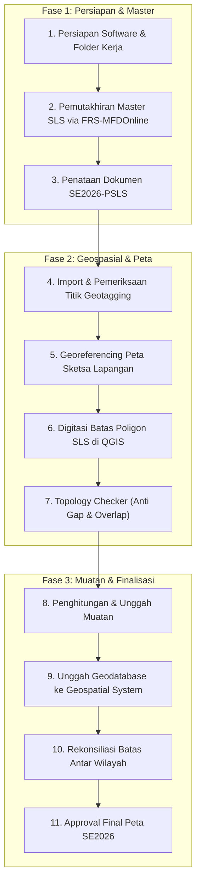

# Materi Pelatihan Wilkerstat SE2026 (Instruktur Daerah / Inda)

Direktori ini memuat arsip terstruktur seluruh materi pelatihan **Instruktur Daerah (Inda)** dan Petugas Pengolahan Penetapan Kerangka Geospasial dan Muatan Wilkerstat Sensus Ekonomi 2026, yang diterbitkan oleh Direktorat Metodologi Statistik dan Sains Data BPS RI.

---

## 📚 Daftar Modul Pelatihan (10 Modul Lengkap)

| No | Kode | Modul Pelatihan | Jumlah Slide | LLM-Ready Markdown | Dokumen PDF Asli |
| :-: | :--: | :--- | :-: | :--- | :--- |
| 01 | `01-pendahuluan-dan-organisasi-pengolahan` | **Pendahuluan dan Organisasi Pengolahan Wilkerstat SE2026** | 15 Slide | [📄 Markdown](md/01-pendahuluan-dan-organisasi-pengolahan.md) | [📑 PDF](pdf/01-pendahuluan-dan-organisasi-pengolahan.pdf) |
| 02 | `02-konsep-dan-definisi` | **Konsep dan Definisi Pengolahan Wilkerstat SE2026** | 57 Slide | [📄 Markdown](md/02-konsep-dan-definisi.md) | [📑 PDF](pdf/02-konsep-dan-definisi.pdf) |
| 03 | `03-metodologi` | **Metodologi Pengolahan Wilkerstat SE2026** | 25 Slide | [📄 Markdown](md/03-metodologi.md) | [📑 PDF](pdf/03-metodologi.pdf) |
| 04 | `04-persiapan-proses-pengolahan` | **Persiapan Proses Pengolahan Wilkerstat SE2026** | 31 Slide | [📄 Markdown](md/04-persiapan-proses-pengolahan.md) | [📑 PDF](pdf/04-persiapan-proses-pengolahan.pdf) |
| 05 | `05-pengolahan-master-wilkerstat-dan-perubahan-sls` | **Pengolahan Master Wilkerstat dan Perubahan SLS** | 63 Slide | [📄 Markdown](md/05-pengolahan-master-wilkerstat-dan-perubahan-sls.md) | [📑 PDF](pdf/05-pengolahan-master-wilkerstat-dan-perubahan-sls.pdf) |
| 06 | `06-pengolahan-titik-bangunan` | **Pengolahan Titik Bangunan Geotagging SE2026** | 18 Slide | [📄 Markdown](md/06-pengolahan-titik-bangunan.md) | [📑 PDF](pdf/06-pengolahan-titik-bangunan.pdf) |
| 07 | `07-pengolahan-peta` | **Pengolahan Peta Digital Wilkerstat di QGIS** | 52 Slide | [📄 Markdown](md/07-pengolahan-peta.md) | [📑 PDF](pdf/07-pengolahan-peta.pdf) |
| 08 | `08-pengolahan-muatan` | **Pengolahan dan Rekonsiliasi Muatan Wilkerstat SE2026** | 15 Slide | [📄 Markdown](md/08-pengolahan-muatan.md) | [📑 PDF](pdf/08-pengolahan-muatan.pdf) |
| 09 | `09-geospatial-system` | **Pemanfaatan Web Geospatial System (GS) BPS** | 43 Slide | [📄 Markdown](md/09-geospatial-system.md) | [📑 PDF](pdf/09-geospatial-system.pdf) |
| 10 | `10-rekonsiliasi-batas` | **Rekonsiliasi Batas Wilkerstat Antar Wilayah** | 9 Slide | [📄 Markdown](md/10-rekonsiliasi-batas.md) | [📑 PDF](pdf/10-rekonsiliasi-batas.pdf) |

---

## 🔄 Alur Tahapan Pengolahan Wilkerstat SE2026

---

## 🎯 Panduan Praktis Inda (Ihza) — Pelaksanaan Pengolahan BPS Mempawah

1. **Jadwal Pelatihan Petugas di BPS Mempawah**: **7 – 11 September 2026**.
2. **Standar Beban Petugas Mitra**: **500 SLS/sub-SLS/non-SLS** per orang selama **1 bulan**.
3. **Target Akhir Penyelesaian**: **11 Oktober 2026** (Pengolahan tuntas dan terunggah ke Geospatial System).
4. **Tools Utama**: QGIS 4.x / LTR dengan 6 plugin aktif, Bulk Rename Utility, FRS-MFDOnline, dan Web Geospatial System.

---

## 🛠️ Inventaris Tools, Model QGIS, & Template Terpasang

| Kategori | Nama Berkas / Komponen | Lokasi di Knowledge Base | Lokasi Profil QGIS Sistem |
| :--- | :--- | :--- | :--- |
| **Model QGIS Titik & Muatan** | `01 Identifikasi Titik.model3` `02 Pengecekan Titik.model3` `03 Updating Posisi Titik Sesuai Peta 2026_1.model3` `04 Pengolahan Muatan.model3` | [`models/`](models/) | `~/.local/share/QGIS/QGIS3/profiles/default/processing/models/` |
| **Model QGIS Cleaning & QC** | `25_Cek_Master_PetaSLS.model3` `25_Cek_Validitas.model3` `25_Dissolve_Desa_Kec.model3` `25_Fill_Gaps.model3` `26_Pengecekan Keselarasan BS dan Desa-SLS_rev.model3` | [`models/`](models/) | `~/.local/share/QGIS/QGIS3/profiles/default/processing/models/` |
| **QGIS Style (.qml)** | `cek_titik.qml` *(Style Geotagging)* `batas_wilkerstat.qml` *(Style Batas Wilayah)* | [`styles/`](styles/) | `~/.local/share/QGIS/QGIS3/profiles/default/styles/` |
| **Template Layout Peta** | `Layout_PETA_WAWBWSWSS-2025.qpt` | [`templates/`](templates/) | `~/.local/share/QGIS/QGIS3/profiles/default/composer_templates/` |
| **Project Master Layout** | `xxxx_Layout_Peta_WAWBWSWSS-2025.qgz` *(+ Batas GPKG & Logo)* | [`layout_project/`](layout_project/) | - |
| **Bulk Rename Utility** | `Bulk Rename Utility.exe` (Portable 64-bit via Wine) | - | `~/.local/share/bulk-rename-utility/64-bit/` |

