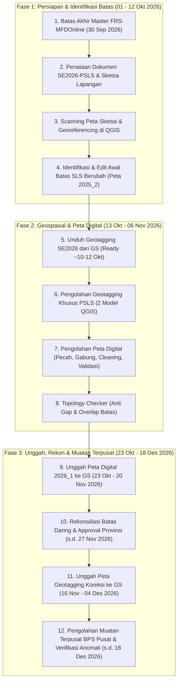

# Materi Pelatihan Wilkerstat SE2026 (Instruktur Daerah / Inda)

Direktori ini memuat arsip terstruktur seluruh materi pelatihan **Instruktur Daerah (Inda)** dan Petugas Pengolahan Penetapan Kerangka Geospasial dan Muatan Wilkerstat Sensus Ekonomi 2026, yang diterbitkan oleh Direktorat Metodologi Statistik dan Sains Data BPS RI.

---

## 📚 Daftar Modul Pelatihan (10 Modul Lengkap)

| No | Kode | Modul Pelatihan | Jumlah Slide | LLM-Ready Markdown | Dokumen PDF Asli |
| :-: | :--: | :--- | :-: | :--- | :--- |
| 01 | `01-pendahuluan-dan-organisasi-pengolahan` | **Pendahuluan dan Organisasi Pengolahan Wilkerstat SE2026** | 15 Slide | [📄 Markdown](md/01-pendahuluan-dan-organisasi-pengolahan.md) | [📑 PDF](pdf/01-pendahuluan-dan-organisasi-pengolahan.pdf) |
| 02 | `02-konsep-dan-definisi` | **Konsep dan Definisi Pengolahan Wilkerstat SE2026** | 57 Slide | [📄 Markdown](md/02-konsep-dan-definisi.md) | [📑 PDF](pdf/02-konsep-dan-definisi.pdf) |
| 03 | `03-metodologi` | **Metodologi Pengolahan Wilkerstat SE2026** | 25 Slide | [📄 Markdown](md/03-metodologi.md) | [📑 PDF](pdf/03-metodologi.pdf) |
| 04 | `04-persiapan-proses-pengolahan` | **Persiapan Proses Pengolahan Wilkerstat SE2026** | 31 Slide | [📄 Markdown](md/04-persiapan-proses-pengolahan.md) | [📑 PDF](pdf/04-persiapan-proses-pengolahan.pdf) |
| 05 | `05-pengolahan-master-wilkerstat-dan-perubahan-sls` | **Pengolahan Master Wilkerstat dan Perubahan SLS** | 63 Slide | [📄 Markdown](md/05-pengolahan-master-wilkerstat-dan-perubahan-sls.md) | [📑 PDF](pdf/05-pengolahan-master-wilkerstat-dan-perubahan-sls.pdf) |
| 06 | `06-pengolahan-titik-bangunan` | **Pengolahan Titik Bangunan Geotagging SE2026** | 18 Slide | [📄 Markdown](md/06-pengolahan-titik-bangunan.md) | [📑 PDF](pdf/06-pengolahan-titik-bangunan.pdf) |
| 07 | `07-pengolahan-peta` | **Pengolahan Peta Digital Wilkerstat di QGIS** | 52 Slide | [📄 Markdown](md/07-pengolahan-peta.md) | [📑 PDF](pdf/07-pengolahan-peta.pdf) |
| 08 | `08-pengolahan-muatan` | **Pengolahan dan Rekonsiliasi Muatan Wilkerstat SE2026** | 15 Slide | [📄 Markdown](md/08-pengolahan-muatan.md) | [📑 PDF](pdf/08-pengolahan-muatan.pdf) |
| 09 | `09-geospatial-system` | **Pemanfaatan Web Geospatial System (GS) BPS** | 43 Slide | [📄 Markdown](md/09-geospatial-system.md) | [📑 PDF](pdf/09-geospatial-system.pdf) |
| 10 | `10-rekonsiliasi-batas` | **Rekonsiliasi Batas Wilkerstat Antar Wilayah** | 9 Slide | [📄 Markdown](md/10-rekonsiliasi-batas.md) | [📑 PDF](pdf/10-rekonsiliasi-batas.pdf) |

---

## 🔄 Alur Tahapan Pengolahan Wilkerstat SE2026

> [!IMPORTANT]
> **Penyesuaian Juknis Pengolahan Wilkerstat SE2026 (18 September 2026)**:
> 1. **Pengolahan Titik Geotagging**: Hanya dilakukan pada SLS/Sub-SLS yang mengalami perubahan batas (PSLS) hasil lapangan SE2026. Model pengolahan titik dipangkas menjadi **hanya 2 model**, dan titik yang diunggah ke GS tetap mempertahankan skema atribut lapangan (`2025_2`), tanpa perlu update manual ke `2026_1` di Kab/Kota.
> 2. **Pengolahan Muatan Terpusat 100% di BPS Pusat**: BPS Kab/Kota **tidak lagi menghitung muatan** (Model `04 Pengolahan Muatan.model3` tidak dijalankan di daerah). BPS Pusat akan menghitung muatan 2026_1 vs 2025_2 secara terpusat dan menerbitkan daftar anomali muatan untuk diverifikasi BPS Kab/Kota.
> 3. **Lihat Rincian Lengkap**: [📄 Penyesuaian Petunjuk Teknis Pengolahan Wilkerstat SE2026](../docs/penyesuaian-juknis-pengolahan-wilkerstat-se2026.md) dan salinan presentasi [📑 PDF Juknis 18 September 2026](../docs/pdf/2026-09-18_Penyesuaian_Juknis_Pengolahan_Wilkerstat.pdf).

---

## 🎯 Panduan Praktis Inda (Ihza) — Pelaksanaan Pengolahan BPS Mempawah

1. **Jadwal Pelatihan Petugas di BPS Mempawah**: **7 – 11 September 2026** (Telah terlaksana).
2. **Standar Beban Petugas Mitra**: **500 SLS/sub-SLS/non-SLS** per orang selama **1 bulan**.
3. **Timeline Kritis Pengolahan**:
   * **30 September 2026**: Batas akhir entri & approval Master SLS di FRS-MFDOnline (Surat B-362).
   * **01 – 12 Oktober 2026**: Scanning peta, identifikasi SLS berubah, georeferencing, edit batas di awal.
   * **10 – 12 Oktober 2026**: Ketersediaan data geotagging SE2026 di Geospatial System (GS) siap unduh.
   * **13 Oktober – 06 November 2026**: Pengolahan Geotagging SE2026 (PSLS) & digitasi/cleaning peta digital.
   * **20 November 2026**: **BATAS MAKSIMAL UNGGAH PETA DIGITAL 2026_1 KE GEOSPATIAL SYSTEM** (Window unggah: 23 Okt – 20 Nov).
   * **02 – 20 November 2026**: Rekonsiliasi batas antar-kabupaten/kota & provinsi (Daring).
   * **27 November 2026**: **BATAS MAKSIMAL APPROVAL PETA DIGITAL OLEH BPS PROVINSI**.
   * **04 Desember 2026**: **BATAS MAKSIMAL UNGGAH PETA GEOTAGGING HASIL KOREKSI KE GEOSPATIAL SYSTEM** (Window unggah: 16 Nov – 04 Des).
   * **18 Desember 2026**: Batas akhir cleaning final BPS Pusat & verifikasi anomali muatan oleh BPS Kab/Kota.
4. **Tools Utama**: QGIS 4.x / LTR dengan plugin terstandar, Bulk Rename Utility, FRS-MFDOnline, Tools Python Splitting BPS Pusat, dan Web Geospatial System.

---

## 🛠️ Inventaris Tools, Model QGIS, & Template Terpasang

| Kategori | Nama Berkas / Komponen | Catatan Operasional (Juknis 18 Sept 2026) | Lokasi di Knowledge Base |
| :--- | :--- | :--- | :--- |
| **Model QGIS Titik & Muatan** | `01 Identifikasi Titik.model3` `02 Pengecekan Titik.model3` *(Model 03 & 04 Tidak Digunakan)* | **Hanya 2 Model Digunakan** (01 & 02) khusus untuk SLS yang berubah (PSLS). Model 03 (Updating ke 2026_1) & Model 04 (Muatan) **ditiadakan** di kab/kota. | [`models/`](models/) |
| **Model QGIS Cleaning & QC** | `25_Cek_Master_PetaSLS.model3` `25_Cek_Validitas.model3` `25_Dissolve_Desa_Kec.model3` `25_Fill_Gaps.model3` `26_Pengecekan Keselarasan BS dan Desa-SLS_rev.model3` | Digunakan penuh untuk validasi topologi batas wilayah kerja statistik. | [`models/`](models/) |
| **QGIS Style (.qml)** | `cek_titik.qml` *(Style Geotagging)* `batas_wilkerstat.qml` *(Style Batas Wilayah)* | Simbologi terstandar verifikasi visual titik dan batas SLS. | [`styles/`](styles/) |
| **Template Layout Peta** | `Layout_PETA_WAWBWSWSS-2025.qpt` | Layout kartografi pencetakan/ekspor peta. | [`templates/`](templates/) |
| **Project Master Layout** | `xxxx_Layout_Peta_WAWBWSWSS-2025.qgz` | Template proyek kerja QGIS terpadu (+ GPKG & Logo). | [`layout_project/`](layout_project/) |
| **Tools Distribusi Beban** | *Skrip Python Splitting Data Geotagging* | Disediakan oleh BPS Pusat untuk membagi data geotagging per petugas (.zip). | - |
| **Bulk Rename Utility** | `Bulk Rename Utility.exe` | Standardisasi nama berkas pindaian peta (Wine 64-bit). | `~/.local/share/bulk-rename-utility/` |

